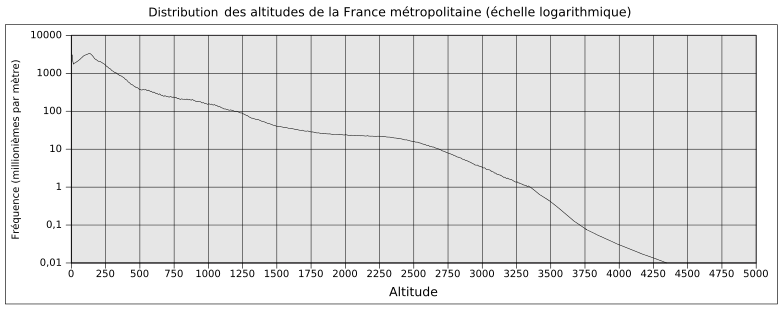
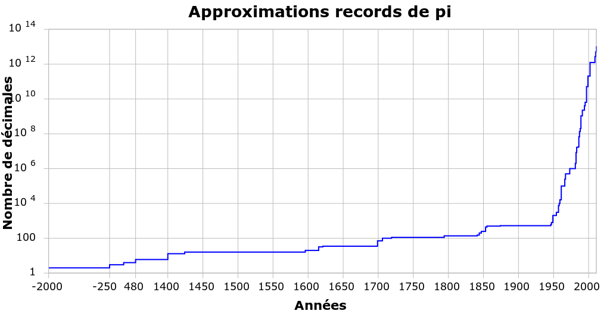

| Cours de mathématiques de sixième année
  4 périodes/semaine
  Année 2018-2019
| Lycée Martin V

| Les fonctions exponentielles et logarithmes sont très utiles dans de
  nombreux contextes. Qu’on parle de radioactivité, de séisme, de
  démographie, d’acidité d’une solution ou encore d’intensité du son,
  elles constituent un outil essentiel pour étudier de nombreux
  phénomènes.
| Par ailleurs, ces fonctions ont également un intérêt mathématique
  intrinsèque remarquable, en particulier la fonction exponentielle de
  base :math:`e` et le logarithme népérien. Nous découvrirons pourquoi
  ainsi que l’identité de ce nombre :math:`e` qui possède un statut
  semblable à celui de :math:`\pi` dans les mathématiques modernes.
|  
| Après avoir donné une courte introduction où seront présentées cinq
  raisons différentes d’explorer ce nouveau chapitre, nous allons
  découvrir la notion de fonction exponentielle en généralisant les
  exposants que nous connaissons déjà : les exposants rationnels. Nous
  définirons ensuite les fonctions logarithmes comme les fonctions
  réciproques des fonctions exponentielles. Enfin, nous apprendrons à
  exploiter ces nouveaux outils et nous reviendrons sur l’introduction.
|  
| Pour ce chapitre, les prérequis sont les suivants :

-  Puissances/exposants naturels, entiers et rationnels

-  Fonctions

-  Limites et continuité de fonctions

-  Dérivées

-  Intégrales

1 Introduction
============

1.1 Des exposants irrationnels ?
----------------------------

| À ce stade, vous êtes déjà familier avec les exposants naturels
  (non-nuls). Par exemple, vous savez certainement quel est le sens de
  la notation :math:`2^3` : il s’agit du nombre :math:`2.2.2=8`.
| Vous êtes également déjà familier avec les exposants entiers et en
  particulier les exposants négatifs. Par exemple, vous savez
  certainement quel est le sens de la notation :math:`5^{-2}` : il
  s’agit du nombre :math:`\frac{1}{5^2}=\frac{1}{5.5}=\frac{1}{25}`.
| Idéalement, vous êtes aussi familier avec les exposants rationnels.
  Par exemple, vous devriez savoir quel est le sens de la notation
  :math:`5^{\frac{2}{3}}` : il s’agit du nombre
  :math:`\sqrt[3]{5^2}=\sqrt[3]{25}`.
|  
| Quid des exposants irrationnels ? Par exemple, la notation suivante
  a-t-elle un sens ?

  .. math:: 2^{\pi}

  A priori, non. Non seulement :math:`\pi` n’est pas un nombre
  rationnel, mais on voit mal comment on pourrait étendre le sens donné
  aux exposants (initialement) pour un exposant tel que :math:`\pi` :

  .. math:: 2^{\pi}=\underbrace{2.2.2.?}_{\text{$\pi$ fois ?}}

  Pourtant, si on entre :math:`2^{\pi}` dans une calculatrice, elle
  retourne une approximation de ce nombre :

  .. math:: 2^{\pi} \simeq 8,82

  Il doit donc sans doute être possible d’accorder à cette notation un
  sens univoque et de calculer ce nombre (ou au moins une approximation
  de ce nombre).
| Dans ce chapitre, nous allons découvrir le sens que l’on peut
  attribuer aux exposants irrationnels et nous essayerons de comprendre
  comment une calculatrice peut nous retourner une telle valeur.

1.2 Des équations irrésolubles ?
----------------------------

| Si on vous demande de trouver un nombre :math:`x \in \mathbb{R}` tel
  que :math:`2^x=8`, vous répondrez sans aucune difficulté que
  :math:`x=3` est solution car :math:`2^3=8`.
| De même, si on vous demande de trouver un nombre
  :math:`x \in \mathbb{R}` tel que :math:`2^x=16`, vous répondrez sans
  aucune difficulté que :math:`x=4` est solution car :math:`2^4=16`.
| À nouveau, si on vous demande de trouver un nombre
  :math:`x \in \mathbb{R}` tel que :math:`2^x=\frac{1}{4}`, vous
  répondrez sans grande difficulté que :math:`x=-2` est solution car
  :math:`2^{-2}=\frac{1}{2^2}=\frac{1}{4}`.
| De manière générale, si le nombre :math:`k \in \mathbb{R}` d’une
  équation :math:`2^x=k` peut être exprimé comme une puissance entière
  de :math:`2`, il est facile de trouver une solution.
| Mais que se passe-t-il si le nombre :math:`k \in \mathbb{R}` ne peut
  pas être exprimé comme une puissance entière de :math:`2` ? Par
  exemple, comment trouver un nombre :math:`x \in \mathbb{R}` tel que :

  .. math:: 2^x=7

  Si un tel nombre :math:`x \in \mathbb{R}` existe (ce qui n’est a
  priori même pas certain), il s’agit sans doute d’un nombre entre
  :math:`2` et :math:`3` (puisque :math:`2^2=4` et :math:`2^3=8`) et
  sans doute un peu plus proche de :math:`3` que de :math:`2`. Mais cela
  ne nous avance pas beaucoup...
| Dans ce chapitre, nous allons voir qu’un tel nombre existe bel et bien
  et nous découvrirons les outils qui permettent de l’exprimer et de
  résoudre une telle équation. Nous verrons que ce type d’équation peut
  apparaître dans plusieurs contextes, dont un que vous avez normalement
  déjà rencontré l’année passé : les intérêts composés.

1.3 Une primitive de la fonction inverse ?
--------------------------------------

| Dans le chapitre des intégrales, nous nous sommes étonnés du fait que
  la fonction inverse était l’unique fonction de référence pour laquelle
  nous n’étions pas capable de trouver une primitive.
| Néanmoins, puisque la fonction inverse est continue, le premier
  théorème fondamental de l’analyse nous garantit son existence, au
  moins sur un intervalle compact.
| Dans ce chapitre, nous allons découvrir cette primitive et nous
  verrons qu’il s’agit d’une fonction extrêmement importante qui a bien
  d’autres propriétés essentielles que celle d’être une primitive de la
  fonction inverse.

1.4 Une fonction qui est sa propre dérivée/primitive ?
--------------------------------------------------

| Dans le cadre du chapitre des intégrales, une question qui peut
  survenir assez naturellement est celle de l’existence d’une fonction
  qui est sa propre dérivée ou (de façon équivalente) sa propre
  primitive.
| Dans ce chapitre, nous allons découvrir une telle fonction et nous
  verrons qu’elle est unique ! De plus, nous apprendrons qu’il s’agit
  d’une fonction extrêmement importante, voire fondamentale. Nous
  verrons qu’elle possède de nombreuses propriétés très intéressantes et
  qu’elle est extrêmement liée à la fameuse primitive de la fonction
  inverse dont nous parlions dans la sous-section précédente.

1.5 Des échelles logarithmiques ?
-----------------------------

| Certaines unités de mesure peuvent être troublantes pour ceux qui ne
  les comprennent pas. Un tremblement de terre d’une magnitude de
  :math:`9` (un cataclysme historique, seulement 5 tremblements de terre
  de cette ampleur ont été recencés dans le monde depuis 1900) n’est
  certainement pas seulement :math:`3` fois plus intense et destructeur
  qu’un tremblement de terre d’une magnitude de :math:`3` (en moyenne,
  il y a plus d’un tremblement de terre de ce type en Belgique par an et
  la plupart des gens l’ignorent). Un son d’une intensité de :math:`120`
  décibels (ce qui correspond environ à l’intensité du son d’une
  vuvuzela proche) n’est certainement pas seulement :math:`2` fois plus
  fort qu’un son de :math:`60` décibels (ce qui correspond environ à
  l’intensité du son lors d’une discussion normale avec une personne
  proche). Une solution dont le pH est de :math:`2` (plus ou moins
  l’acidité de l’acide gastrique) n’est certainement pas seulement
  :math:`2` fois plus acide qu’une solution dont le pH est de :math:`4`
  (plus ou moins l’acidité d’un vin).
| Il se trouve que toutes ces unités cachent en fait une échelle
  *logarithmique*. Pour comprendre ces échelles et ces unités, il est
  essentiel de comprendre la notion à partir de laquelle elles sont
  construites : les fonctions logarithmes.
| Dans ce chapitre, nous allons non seulement découvrir ces fonctions
  logarithmes, mais nous intéresserons également dans la dernière
  section du chapitre à la façon dont elles permettent de parler
  d’échelles logarithmiques.

2 Fonctions exponentielles
========================

2.1 Définition
----------

| Pour une base strictement positive
  :math:`a \in {{\mathbb{R}}_{0}}^{+}`, les exposants naturels, entiers
  et rationnels sont déjà définis. On peut donc déjà construire des
  fonctions exponentielles sur :math:`\mathbb{Q}`. Par exemple, si
  :math:`a=2`, on peut considérer la fonction :

  .. math::

     \begin{aligned}
     f : \mathbb{Q}\to& \mathbb{R}\\
     x \mapsto& 2^x\end{aligned}

  Dont le graphe est une succession de points non continue :

.. tikz:: 

      \draw[step=1cm,gray,very thin] (-5,-5) grid (5,5);

      \draw[very thick,->] (-5,0) -- (6,0) node[anchor=south west] {x};
		\draw[very thick,->] (0,-5) -- (0,6) node[anchor=south west] {y};

      \foreach \x in {1}
		\draw (\x cm,1pt) -- (\x cm,-1pt) node[anchor=north] {$\x$};

      \foreach \y in {1}
		\draw (1pt,\y cm) -- (-1pt,\y cm) node[anchor=east] {$\y$};

      \foreach \x in {-200,...,-150} \draw[thick,blue] (0.025*\x,2^0.025^\x)node{.};
      \foreach \x in {-150,...,-100} \draw[thick,blue] (0.025*\x,2^0.025^\x)node{.};
      \foreach \x in {-100,...,-50} \draw[thick,blue] (0.025*\x,2^0.025^\x)node{.};
      \foreach \x in {-50,...,0} \draw[thick,blue] (0.025*\x,2^0.025^\x)node{.};
      \foreach \x in {0,...,100} \draw[thick,blue] (0.0125*\x,2^0.0125^\x)node{.};
      \foreach \x in {100,...,186} \draw[thick,blue] (0.0125*\x,2^0.0125^\x)node{.};

Nous aimerions étendre cette fonction sur :math:`\mathbb{R}`. Mais pas
de n’importe quelle manière. Un prolongement tel que la fonction :

.. math::

   \begin{aligned}
   g : \mathbb{R}\to& \mathbb{R}\\
   x \mapsto& \begin{cases}
       2^x & \text{si } x \in \mathbb{Q}\\
       0 & \text{si } x \notin \mathbb{Q}
     \end{cases}\end{aligned}

dont le graphe ressemble à :

.. tikz:: 

      \draw[step=1cm,gray,very thin] (-5,-5) grid (5,5);

      \draw[very thick,->] (-5,0) -- (6,0) node[anchor=south west] {x};
		\draw[very thick,->] (0,-5) -- (0,6) node[anchor=south west] {y};

      \foreach \x in {1}
		\draw (\x cm,1pt) -- (\x cm,-1pt) node[anchor=north] {$\x$};

      \foreach \y in {1}
		\draw (1pt,\y cm) -- (-1pt,\y cm) node[anchor=east] {$\y$};

      \draw[very thick,blue] plot[domain=-5:5](\x,{0*\x});
      \foreach \x in {-200,...,-150} \draw[thick,blue] (0.025*\x,2^0.025^\x)node{.};
      \foreach \x in {-150,...,-100} \draw[thick,blue] (0.025*\x,2^0.025^\x)node{.};
      \foreach \x in {-100,...,-50} \draw[thick,blue] (0.025*\x,2^0.025^\x)node{.};
      \foreach \x in {-50,...,0} \draw[thick,blue] (0.025*\x,2^0.025^\x)node{.};
      \foreach \x in {0,...,100} \draw[thick,blue] (0.0125*\x,2^0.0125^\x)node{.};
      \foreach \x in {100,...,186} \draw[thick,blue] (0.0125*\x,2^0.0125^\x)node{.};

| n’est certainement pas très intéressant.
|  
| Intuitivement, nous aimerions obtenir un prolongement de la fonction
  :math:`f` qui suit le tracé formé par les points déjà définis . Plus
  rigoureusement, nous aimerions que le résultat soit continu, nous
  aimerions donc prolonger :math:`f` de façon continue.
| C’est ici qu’intervient un théorème dont la démonstration n’est
  absolument pas à notre portée mais qui va nous garantir qu’un tel
  prolongement existe et de plus est unique.

**Théorème 2.1.1** (Théorème de prologement par densité). 

  Soit :math:`f : \mathbb{Q}\to \mathbb{R}` une fonction qui est
  Cauchy-continue.

  Alors il existe une unique fonction
  :math:`g : \mathbb{R}\to \mathbb{R}` qui est un prolongement continu
  de :math:`f` sur :math:`\mathbb{R}`.

| 
  La notion de Cauchy-continuité est une notion un peu plus forte que
  celle de continuité et nous ne rentrerons pas dans les détails. Ce
  qu’il faut retenir est que pour tout
  :math:`a \in {{\mathbb{R}}_{0}}^{+}`, la fonction :

  .. math::

     \begin{aligned}
     f_a : \mathbb{Q}\to& \mathbb{R}\\
     x \mapsto& a^x\end{aligned}

  est Cauchy-continue, ce qui implique que le théorème de prolongement
  par densité garantit l’existence d’un unique prolongement continu
  :math:`g_a : \mathbb{R}\to \mathbb{R}` de :math:`f_a` sur
  :math:`\mathbb{R}`.
|  
| Fantastique ! Nous pouvons donc définir les fonctions exponentielles
  pour toute base :math:`a \in {{\mathbb{R}}_{0}}^{+}` sur
  :math:`\mathbb{R}` :

**Définition 2.1.2.** Soit :math:`a \in {{\mathbb{R}}_{0}}^{+}`.

  La fonction exponentielle de base :math:`a`, notée
  :math:`{\exp}_a : \mathbb{R}\to \mathbb{R}`, est l’unique prolongement
  continu sur :math:`\mathbb{R}` de la fonction :

  .. math::

     \begin{aligned}
     f_a : \mathbb{Q}\to& \mathbb{R}\\
     x \mapsto& a^x\end{aligned}

**Remarque 2.1.3.** Par continuité, le graphe de la fonction
:math:`{\exp}_2 : \mathbb{R}\to \mathbb{R}` ressemble par exemple à :

.. tikz::

      \draw[step=1cm,gray,very thin] (-5,-5) grid (5,5);

      \draw[very thick,->] (-5,0) -- (6,0) node[anchor=south west] {x};
		\draw[very thick,->] (0,-5) -- (0,6) node[anchor=south west] {y};

      \foreach \x in {1}
		\draw (\x cm,1pt) -- (\x cm,-1pt) node[anchor=north] {$\x$};

      \foreach \y in {1}
		\draw (1pt,\y cm) -- (-1pt,\y cm) node[anchor=east] {$\y$};
      \draw[very thick,blue] plot[domain=-5:2.34](\x,{2^\x});

Cette fois-ci, comme la fonction
:math:`{\exp}_2 : \mathbb{R}\to \mathbb{R}` est bien définie sur tout
:math:`\mathbb{R}` et pas seulement sur :math:`\mathbb{Q}`, le graphe de
la fonction est bien un tracé continu.

**Remarque 2.1.4.** Pour tout :math:`a \in {{\mathbb{R}}_{0}}^{+}`, nous sommes déjà
capables d’évaluer les fonctions :math:`{\exp}_a` en tout nombre
rationnel. En effet, puisque les fonctions :math:`{\exp}_a` sont les
prolongements continus des fonctions exponentielles sur
:math:`\mathbb{Q}`, si :math:`x \in \mathbb{Q}`, le nombre
:math:`{\exp}_a (x)` est tout simplement :math:`a^x` au sens des
exposants rationnels. En particulier, pour tout
:math:`a \in {{\mathbb{R}}_{0}}^{+}`, le nombre :math:`{\exp}_a (0)` est
:math:`a^0` c’est-à-dire :math:`1` et le nombre :math:`{\exp}_a (1)` est
:math:`a^1` c’est-à-dire :math:`a`. Géométriquement, cela correspond au
fait que le graphe de toute fonction exponentielle :math:`{\exp}_a`
passe par les point :math:`(0;1)` et :math:`(1;a)`.

**Notation.** Même si elle est au moins dans un premier temps un peu abusive, la
notation suivante est utilisée pour désigner les images des fonctions
:math:`{\exp}_a` pour :math:`a \in {{\mathbb{R}}_{0}}^{+}` :

Pour tout :math:`x \in \mathbb{R}` (même quand :math:`x` n’est pas un
nombre rationnel), on note :

.. math:: {\exp}_a (x) = a^x

Comme les fonctions exponentielles :math:`{\exp}_a` sont les
prolongements continus des fonctions exponentielles sur
:math:`\mathbb{Q}`, il n’est pas étonnant que l’on reprend la notation
des expressions formelles de ces fonctions. Nous verrons que cet abus de
notation prend tout son sens en étudiant les propriétés des fonctions
exponentielles :math:`{\exp}_a` dans la prochaine section.

**Remarque 2.1.4.** Le sens d’une notation telle que :math:`2^{\pi}` ne vous est donc plus
inconnu. Il s’agit tout simplement de :math:`{\exp}_2 (\pi)`.
Malheureusement, le théorème de prolongement par densité ne nous dit
absolument pas comment calculer cette quantité. Sans la démonstration de
ce théorème, nous ne pouvons même pas estimer ce nombre et cette
nouvelle connaissance du sens de la notation :math:`2^{\pi}` est
honnêtement assez insatisfaisante. Malheureusement, nous ne pourrons pas
remédier à cela dans ce cours.

2.2 Propriétés élémentaires
-----------------------

Listons à présent les propriétés élémentaires de nos nouvelles fonctions
de référence : les fonctions exponentielles. Toutes ces propriétés
découlent directement du fait que les fonctions exponentielles sont
définis comme prolongements continus des fonctions exponentielles sur
:math:`\mathbb{Q}`. Malheureusement, nous n’en démontrerons aucune dans
le cadre de ce cours.

**Proposition 2.2.1.** Soit :math:`a \in {\mathbb{R}}_{0}^{+}`.
Le domaine de définition de la fonction :math:`{\exp}_a` est :math:`\mathbb{R}`.

**Proposition 2.2.2.** Soit :math:`a \in {\mathbb{R}}_{0}^{+}`.

Si :math:`a=1`, l’image de la fonction :math:`{\exp}_a` est
:math:`\{1\}`.

Si :math:`a \neq 1`, l’image de la fonction :math:`{\exp}_a` est
:math:`{\mathbb{R}}_{0}^{+}`.

**Proposition 2.2.3.** Soit :math:`a \in {\mathbb{R}}_{0}^{+}`.

Si :math:`a<1`, la fonction :math:`{\exp}_a` est strictement
décroissante.

Si :math:`a = 1`, la fonction :math:`{\exp}_a` est constante.

Si :math:`a<1`, la fonction :math:`{\exp}_a` est strictement
croissante.

**Exemple 2.2.4.** Par exemple, si :math:`a=\frac{1}{3}`, la fonction
:math:`{\exp}_{\frac{1}{4}}` est strictement décroissante :

.. tikz::

      \draw[step=1cm,gray,very thin] (-5,-5) grid (5,5);

      \draw[very thick,->] (-5,0) -- (6,0) node[anchor=south west] {x};
		\draw[very thick,->] (0,-5) -- (0,6) node[anchor=south west] {y};

      \foreach \x in {1}
		\draw (\x cm,1pt) -- (\x cm,-1pt) node[anchor=north] {$\x$};

      \foreach \y in {1}
		\draw (1pt,\y cm) -- (-1pt,\y cm) node[anchor=east] {$\y$};

      \draw[very thick,blue] plot[domain=-1.158:5](\x,{0.25^\x});

Si :math:`a=1`, la fonction :math:`{\exp}_{1}` est constante :

.. tikz::

      \draw[step=1cm,gray,very thin] (-5,-5) grid (5,5);

      \draw[very thick,->] (-5,0) -- (6,0) node[anchor=south west] {x};
		\draw[very thick,->] (0,-5) -- (0,6) node[anchor=south west] {y};

      \foreach \x in {1}
		\draw (\x cm,1pt) -- (\x cm,-1pt) node[anchor=north] {$\x$};

      \foreach \y in {1}
		\draw (1pt,\y cm) -- (-1pt,\y cm) node[anchor=east] {$\y$};
      \draw[very thick,blue] plot[domain=-5:5](\x,{1^\x});

Si :math:`a=4`, la fonction :math:`{\exp}_{4}` est strictement
croissante :

.. tikz::

      \draw[step=1cm,gray,very thin] (-5,-5) grid (5,5);

      \draw[very thick,->] (-5,0) -- (6,0) node[anchor=south west] {x};
		\draw[very thick,->] (0,-5) -- (0,6) node[anchor=south west] {y};

      \foreach \x in {1}
		\draw (\x cm,1pt) -- (\x cm,-1pt) node[anchor=north] {$\x$};

      \foreach \y in {1}
		\draw (1pt,\y cm) -- (-1pt,\y cm) node[anchor=east] {$\y$};
      \draw[very thick,blue] plot[domain=-5:1.158](\x,{4^\x});

**Remarque 2.2.5.** Le "type de croissance" des fonctions exponentielles est différent de tous
ceux des autres fonctions que vous connaissez. Par exemple, si
:math:`a > 1`, la fonction :math:`{\exp}_{a}` est strictement croissante
et cette croissance est de plus en plus forte au fur et à mesure que
:math:`x \in \mathbb{R}` augmente. Pour passer de :math:`{\exp}_{a}(x)`
à :math:`{\exp}_{a}(x+1)`, on multiplie toujours par :math:`a`, ce qui
donne une croissance explosive de plus en plus rapide qui finira
toujours par dépasser celle de n’importe quelle fonction polynomiale. On
appelle ce type de croissance une croissance *exponentielle* (je vous
laisse deviner pourquoi).

Puisque les fonctions exponentielles sont définies comme les
prolongements continus des fonctions exponentielles sur
:math:`\mathbb{Q}`, on peut être certain qu’elles sont... continues :

**Proposition 2.2.6.** Soit :math:`a \in {\mathbb{R}}_{0}^{+}`.
La fonction :math:`{\exp}_a` est continue.

La limite en un point :math:`c \in \mathbb{R}` d’une fonction
exponentielle est donc toujours égale à son image en ce point. Par
ailleurs, on a :

**Proposition 2.2.7.** Soit :math:`a \in {\mathbb{R}}_{0}^{+}`.

Si :math:`a<1`, on a :math:`\lim\limits_{x \to -\infty} {\exp}_a(x) = +\infty` et :math:`\lim\limits_{x \to +\infty} {\exp}_a(x) = 0`.

Si :math:`a = 1`, on a :math:`\lim\limits_{x \to -\infty} {\exp}_a(x) = 1` et :math:`\lim\limits_{x \to +\infty} {\exp}_a(x) = 1`.

Si :math:`a>1`, on a :math:`\lim\limits_{x \to -\infty} {\exp}_a(x) = 0` et :math:`\lim\limits_{x \to +\infty} {\exp}_a(x) = +\infty`.

Vient à présent un des résultats les plus importants au sujet des
fonctions exponentielles. Celui-ci correspond à la bonne nouvelle selon
laquelle notre définition des fonctions exponentielles comme
prolongements continus des fonctions exponentielles sur
:math:`\mathbb{Q}` permet de démontrer que les règles de calcul des
exposants que nous avions pour les exposants rationnels fonctionnent
également pour tous les exposants réels (même ceux qui ne sont pas
rationnels). C’est également cette proposition qui permet de justifier
la notation quelque peu abusive utilisée pour dénoter les images des
fonctions exponentielles.

**Proposition 2.2.8.** Soient :math:`a,b \in {\mathbb{R}}_{0}^{+}`.

#. Pour tout :math:`x,y \in \mathbb{R}`, on a :

   .. math:: {\exp}_a(x+y)={\exp}_a(x) . {\exp}_a(y)

   .. math:: a^{x+y} = a^x . a^y

#. Pour tout :math:`x \in \mathbb{R}`, on a :

   .. math:: {\exp}_{ab}(x) = {\exp}_a(x) . {\exp}_b(x)

   .. math:: (a.b)^x = a^x.b^x

#. Pour tout :math:`x \in \mathbb{R}`, on a :

   .. math:: {\exp}_{{\exp}_a(x)}(y)  = {\exp}_a(x.y)

   .. math:: (a^x)^y  = a^{x.y}

#. Pour tout :math:`x,y \in \mathbb{R}`, on a :

   .. math:: {\exp}_a(x-y)  = \frac{{\exp}_a(x)}{{\exp}_a(y)}

   .. math:: a^{x-y}  = \frac{a^{x}}{a^{y}}

#. Pour tout :math:`x \in \mathbb{R}`, on a :

   .. math:: {\exp}_{\frac{a}{b}}(x)  = \frac{{\exp}_a(x)}{{\exp}_b(x)}

   .. math:: {\left(\frac{a}{b}\right)}^x  = \frac{a^{x}}{b^{x}}

Avec cette dernière proposition, la notation pour les images des
fonctions exponentielles prend tout son sens. En effet, on sait à
présent qu’en plus de coincider avec les fonctions exponentielles sur
:math:`\mathbb{Q}`, les fonctions exponentielles :math:`{\exp}_a` (pour
:math:`a \in {\mathbb{R}}_{0}^{+}`) possèdent les mêmes propriétés
calculatoires que ces fonctions exponentielles sur :math:`\mathbb{Q}`.
En fait, ce sont ces propriétés qui sont fondamentales et qui
caractérisent principalement les fonctions exponentielles, en
particulier la première : les fonctions exponentielles sont des
fonctions définies sur :math:`\mathbb{R}` qui transforment des sommes en
produits !

2.3 La fonction exponentielle :math:`\exp` et le nombre :math:`e`
-------------------------------------------------------------

| Les fonctions exponentielles
  :math:`{\exp}_a : \mathbb{R}\to \mathbb{R}` (pour
  :math:`a \in {\mathbb{R}}_{0}^{+}`) sont continues, mais sont-elles
  dérivables ?
| Si :math:`a=1`, la fonction :math:`{\exp}_1` est la fonction constante
  de constante :math:`1`. Elle est évidemment dérivable.
| Mais qu’en est-il si :math:`a \neq 1` ? Géométriquement, étant donné
  les graphes de ces fonctions, nous aurions tendance à dire que oui (il
  n’y a pas de cassure dans le graphe). Nous allons voir que les
  fonctions exponentielles :math:`{\exp}_a : \mathbb{R}\to \mathbb{R}`
  (pour :math:`a \in {\mathbb{R}}_{0}^{+}\backslash \{1\}`) ont une
  propriété intéressante : si elles sont dérivables en :math:`0`, alors
  elles sont automatiquement dérivables partout.
| En effet, soit :math:`a \in {\mathbb{R}}_{0}^{+}\backslash \{1\}`, que
  signifie que la fonction :math:`{\exp}_a : \mathbb{R}\to \mathbb{R}`
  est dérivable en :math:`0` ? Cela signifie que la limite suivante
  existe :

  .. math:: \lim\limits_{x \to 0} \frac{{\exp}_a(x)-{\exp}_a(0)}{x-0}

  .. math:: \lim\limits_{x \to 0} \frac{a^x-a^0}{x}

  .. math:: \lim\limits_{x \to 0} \frac{a^x-1}{x}

  Si cette limite existe, alors par linéarité des limites, pour tout
  :math:`c \in \mathbb{R}`, les limites suivantes existent également :

  .. math:: a^c \lim\limits_{x \to 0} \frac{a^x-1}{x}

  .. math:: \lim\limits_{x \to 0} a^c.\frac{a^x-1}{x}

  .. math:: \lim\limits_{x \to 0} \frac{a^{x+c}-a^c}{x}

  .. math:: \lim\limits_{x \to c} \frac{a^{(x-c)+c}-a^c}{(x-c)}

  .. math:: \lim\limits_{x \to c} \frac{a^{x}-a^c}{x-c}

  .. math:: \lim\limits_{x \to c} \frac{{\exp}_a(x)-{\exp}_a(c)}{x-c}

  Et donc la fonction :math:`{\exp}_a` est aussi dérivable en tout
  :math:`c \in \mathbb{R}`. De plus, on remarque que si la fonction
  :math:`{\exp}_a` est dérivable en :math:`0`, alors pour tout
  :math:`c \in \mathbb{R}` on a :

  .. math:: ({\exp}_a)'(c) = {\exp}_a (c) . ({\exp}_a)' (0)

  Si les fonctions :math:`{\exp}_a` sont dérivables, alors pour tout
  :math:`a \in {\mathbb{R}}_{0}^{+}\backslash \{1\}` la dérivée de
  :math:`{\exp}_a` est elle-même fois une constante et cette constante
  est le nombre dérivée de :math:`{\exp}_a` en :math:`0`.
|  
| Mais alors, si on peut trouver un nombre
  :math:`\textbf{a} \in {\mathbb{R}}_{0}^{+}\backslash \{1\}` tel que :

  .. math:: \lim\limits_{x \to 0} \frac{{\textbf{a}}^x-1}{x} = 1

  La fonction :math:`{\exp}_{\textbf{a}} : \mathbb{R}\to \mathbb{R}`
  sera une fonction qui est dérivable et qui est égale à sa propre
  dérivée ! Un tel nombre existe-t-il ? Oui : c’est le nombre dénoté
  habituellement par la lettre :math:`e`.

**Théorème 2.3.1.** (Théorème du nombre *e*)

  Il existe un unique nombre
  :math:`\textbf{a} \in {\mathbb{R}}_{0}^{+}\backslash \{1\}` tel que :

  .. math:: \lim\limits_{x \to 0} \frac{{\textbf{a}}^x-1}{x} = 1

  Ce nombre est noté :math:`e` et vaut approximativement :

  .. math:: e \simeq 2.71828182846

| Malheureusement, la démonstration de ce théorème dépasse une fois de
  plus le cadre de ce cours.
|  
| La fonction exponentielle de base :math:`e` a un nom spécifique et une
  notation spécifique.

**Définition 2.3.2.** La fonction *exponentielle (naturelle)* est la fonction
:math:`{\exp}_{e} : \mathbb{R}\to \mathbb{R}` et elle est généralement
notée :math:`\exp : \mathbb{R}\to \mathbb{R}`.

Étant donné l’existence (et l’unicité) du nombre :math:`e`, nous pouvons
démontrer que la fonction exponentielle (de base :math:`e`) est
dérivable et égale à sa propre dérivée.

**Proposition 2.3.3.** La fonction exponentielle de base :math:`e` est dérivable et sa dérivée
est égale à elle-même.

Soit :math:`c \in \mathbb{R}` quelconque. Montrons que la fonction
:math:`\exp : \mathbb{R}\to \mathbb{R}` est dérivable en :math:`c` et
que le nombre dérivée de :math:`\exp` en :math:`c` vaut :math:`\exp(c)`.
Il faut donc montrer que :

.. math:: \lim\limits_{x \to c}  \frac{\exp(x)- \exp(c)}{x-c} = \exp(c)

.. math:: \lim\limits_{x \to c}  \frac{e^{x}-e^c}{x-c} = \exp(c)

Or, par le théorème du nombre :math:`e`, on sait que :

.. math:: \lim\limits_{x \to 0} \frac{e^x-1}{x} = 1

On a donc :

.. math:: \exp(c) \lim\limits_{x \to 0} \frac{e^x-1}{x} = \exp(c)

.. math:: e^c \lim\limits_{x \to 0} \frac{e^x-1}{x} = \exp(c)

Par linéarité des limites, on a :

.. math:: \lim\limits_{x \to 0} e^c \frac{e^x-1}{x} = \exp(c)

.. math:: \lim\limits_{x \to 0}  \frac{e^{x+c}-e^c}{x} = \exp(c)

.. math:: \lim\limits_{x \to c}  \frac{e^{(x-c)+c}-e^c}{(x-c)} = \exp(c)

.. math:: \lim\limits_{x \to c}  \frac{e^{x}-e^c}{x-c} = \exp(c)

**Remarque 2.3.4.** C’est cette dernière proposition qui rend le nombre :math:`e` aussi
incroyable : il s’agit de l’unique nombre réel strictement positif tel
que l’exponentielle ayant pour base ce nombre est dérivable et égale à
sa dérivée. Cette propriété du nombre :math:`e` fait qu’il possède un
statut aussi important dans les mathématiques qu’une autre constante
remarquable que vous connaissez bien : :math:`\pi`.

**Remarque 2.3.5.** La fonction exponentielle est une fonction extrêmement importante en
analyse mathématique, en particulier dans la théorie des équations
différentielles. Une équation différentielle est une équation dont la
ou les inconnues ne sont pas des nombres mais des fonctions
dérivables. L’exponentielle est l’unique solution qui vaut :math:`1`
en :math:`0` à ce qui est peut-être la plus simple des équations
différentielles intéressantes :
.. math:: f=f'
Effectivement, l’exponentielle est bien une fonction égale à sa propre
dérivée.
Les équations différentielles sont extrêmement importantes en
sciences. La formalisation de la plupart des phénomènes naturels passe
par des équations différentielles.

Bien, nous avons donc montré que l’exponentielle de base :math:`e` est
dérivable et nous nous sommes rendus compte qu’il s’agissait d’une
fonction dérivable égale à sa propre dérivée. Qu’en est-il des autres
fonctions exponentielles ? Pour le savoir, nous allons d’abord devoir
parler des logarithmes qui sont les fonctions réciproques des fonctions
exponentielles. Néanmoins, chaque chose en son temps : entraînons-nous
d’abord à manipuler nos nouvelles fonctions de référence, les fonctions
exponentielles.

2.4 Exercices
---------

**Exercice 2.4.1.** En utilisant les propriétés élémentaires des fonctions exponentielles,
calculer les nombres suivants sans avoir recours à une calculatrice.

.. inginious:: foncExp1_1
.. inginious:: foncExp1_2
.. inginious:: foncExp1_3
.. inginious:: foncExp1_4

**Exercice 2.4.2.** Donner les domaines de définition réels maximaux pour les fonctions dont
les expressions sont les suivantes :

.. inginious:: foncExp2_1
.. inginious:: foncExp2_2
.. inginious:: foncExp2_3
.. inginious:: foncExp2_4

**Exercice 2.4.3.** En utilisant les règles de transformations des graphes et les propriétés
des fonctions exponentielles, tracer les graphes des fonctions
suivantes.

.. inginious:: foncExp3_1
.. inginious:: foncExp3_2
.. inginious:: foncExp3_3
.. inginious:: foncExp3_4

**Exercice 2.4.4** Pour les fonctions suivantes, déterminer si elles convergent ou
divergent pour :math:`x \to -\infty` et :math:`x \to +\infty`.

.. inginious:: foncExp4_1
.. inginious:: foncExp4_2
.. inginious:: foncExp4_3
.. inginious:: foncExp4_4
.. inginious:: foncExp4_5
.. inginious:: foncExp4_6
.. inginious:: foncExp4_7
.. inginious:: foncExp4_8

**Exercice 2.4.5.** Calculer les dérivées des fonctions dérivables suivantes.

.. inginious:: foncExp5_1
.. inginious:: foncExp5_2
.. inginious:: foncExp5_3
.. inginious:: foncExp5_4
.. inginious:: foncExp5_5
.. inginious:: foncExp5_6
.. inginious:: foncExp5_7
.. inginious:: foncExp5_8

**Exercice 2.4.6.** Donner l’équation cartésienne de la tangente au graphe de la fonction
:math:`f` donnée ci-dessous au point d’abscisse :math:`1`.

.. math::

   \begin{aligned}
   f : \mathbb{R}&\to \mathbb{R}\\
   x \mapsto & e^{-x}.(x+1)\end{aligned}

.. inginious:: foncExp6

**Exercice 2.4.7. et Exercice 2.4.8.** 

.. inginious:: foncExp7

**Exercice 2.4.9.** La fonction suivante possède-t-elle un maximum ? Si oui, quel est-il et
quel est le point de maximum associé ?

.. math::

   \begin{aligned}
   f : [0;1] &\to \mathbb{R}\\
   x \mapsto & e^{3x}  (x-1)^2\end{aligned}

.. inginious:: foncExp8

**Exercice 2.4.10.** Donner une primitive de la fonction exponentielle.

**Solution.** La fonction exponentielle.

**Exercice 2.4.11.** Calculer les intégrales des fonctions intégrables suivantes.

.. inginious:: foncExp9_1
.. inginious:: foncExp9_2
.. inginious:: foncExp9_3
.. inginious:: foncExp9_4
.. inginious:: foncExp9_5
.. inginious:: foncExp9_6
.. inginious:: foncExp9_7
.. inginious:: foncExp9_8

3 Fonctions réciproques
=====================

Dans cette section, nous allons découvrir les notions et les résultats
qui nous permettront de définir les fonctions logarithmes.

3.1 Bijections
----------

Dans un premier temps, intéressons-nous aux fonctions injectives.
Grossièrement, les fonctions injectives sont les fonctions qui ne
donnent jamais deux fois le même résulat .

**Définition 3.1.1.** Soit :math:`f : \mathop{\mathrm{dom}}(f) \to \mathbb{R}` une fonction
réelle.
On dit que :math:`f` est *injective* si pour tout
:math:`x_1,x_2 \in \mathop{\mathrm{dom}}(f)`, si
:math:`f(x_1)=f(x_2)`, alors :math:`x_1=x_2`.

**Remarque 3.1.2.** Géométriquement, dire qu’une fonction réelle
:math:`f : \mathop{\mathrm{dom}}(f) \to \mathbb{R}` est injective
revient à dire que son graphe a toujours au plus une intersection avec
n’importe quelle droite horizontale.

**Exemple 3.1.3.** La fonction cubique est injective. En effet, si on a deux nombres
:math:`x,y \in \mathbb{R}` tels que :math:`x^3=y^3`, cela implique que
:math:`x=y`. Ils n’existent pas deux nombres différents qui ont le même
cube.

**Contre-exemple 3.1.4.** La fonction carrée n’est pas injective. En effet, si on a deux nombres
:math:`x,y \in \mathbb{R}` tels que :math:`x^2=y^2`, cela n’implique pas
nécessairement que :math:`x=y`. Par exemple, si :math:`x=2` et
:math:`y=-2`, on a :math:`2^2=(-2)^2` sans avoir :math:`2=-2`.

Donnons à présent la définition de fonction surjective (sur un
ensemble). Intuitivement, dire qu’une fonction est surjective sur un
ensemble revient à dire que cette fonction parvient à atteindre tous les
éléments de cet ensemble.

**Définition 3.1.5.** Soit :math:`f : \mathop{\mathrm{dom}}(f) \to \mathbb{R}` une fonction
réelle. Soit :math:`A \subseteq \mathbb{R}`.
On dit que :math:`f` est *surjective* (sur :math:`A`) si pour tout
:math:`y \in A`, il existe au moins un
:math:`x \in \mathop{\mathrm{dom}}(f)` tel que :math:`f(x)=y`.

**Remarque 3.1.6.** Par définition de l’image d’une fonction, toute fonction est surjective
sur son image.

**Exemple 3.1.7.** La fonction cubique est surjective sur :math:`\mathbb{R}`. En effet, si
on prend :math:`y \in \mathbb{R}`, on peut trouver un :math:`x` dans le
domaine de la fonction cubique (c’est-à-dire :math:`\mathbb{R}`) tel que
:math:`x^3=y` : il suffit de prendre :math:`x=\sqrt[3]{y}`.

**Contre-exemple 3.1.8.** La fonction carrée n’est pas surjective sur :math:`\mathbb{R}`. En
effet, si on prend :math:`y \in \mathbb{R}`, on ne peut pas
nécessairement trouver un :math:`x` dans le domaine de la fonction
cubique (c’est-à-dire :math:`\mathbb{R}`) tel que :math:`x^2=y` : si
par exemple :math:`y=-4`, il est impossible de trouver un nombre réel
dont le carré vaut :math:`-4`.
Par contre, la fonction carrée est bien surjective sur son image,
c’est-à-dire :math:`{\mathbb{R}}^{+}`.

En combiant les notions de fonctions injectives et bijectives, on
obtient la notion de bijection.

**Définition 3.1.9.** Soit :math:`f : \mathop{\mathrm{dom}}(f) \to \mathbb{R}` une fonction
réelle. Soit :math:`A \subseteq \mathbb{R}`.
On dit que :math:`f` est une *bijective* (sur :math:`A`) si elle est
injective et qu’elle est surjective (sur :math:`A`). On dit alors que
:math:`f` est une *bijection* (sur :math:`A`).

**Remarque 3.1.10.** Une bijection est une fonction qui associe à tout élément de l’ensemble
de départ un unique élément de l’ensemble d’arrivée (comme toute
fonction) mais qui réalise également l’inverse : à tout élément de
l’ensemble d’arrivée correspond un unique élément de l’ensemble de
départ. Une bijection correspond intuitivement à relier chaque élément
d’un ensemble avec un élément d’un autre ensemble de sorte que tout
élément d’un des deux ensembles ait un unique compagnon dans l’autre
ensemble.

|image1| 

Un exemple graphique de bijection.

**Exemple 3.1.11.** La fonction cubique est une bijection sur :math:`\mathbb{R}`.

**Contre-exemple 3.1.12.** La fonction carrée n’est pas une bijection sur :math:`\mathbb{R}` car
elle n’est pas surjective sur :math:`\mathbb{R}`, mais elle n’est même
pas une bijection sur son image, c’est-à-dire :math:`{\mathbb{R}}^{+}`,
car elle n’est pas injective.

.. _fonctions-réciproques-1:

3.2 Fonctions réciproques
---------------------

Nous pouvons à présent donner la notion qui nous permettra de définir
les fonctions logarithmes : celle de fonction réciproque.

**Définition 3.2.1.** Soit :math:`f : \mathop{\mathrm{dom}}(f) \to \mathbb{R}` une fonction
réelle.
Une *(fonction) réciproque* de la fonction :math:`f` est une fonction
:math:`g : \mathop{\mathrm{dom}}(g) \to \mathbb{R}` telle que
:math:`\mathop{\mathrm{dom}}(g) = \mathop{\mathrm{im}}(f)` et telle
que :

#. Pour tout :math:`x \in \mathop{\mathrm{dom}}(f)` :

   .. math:: (g \circ f) (x) = g(f(x)) = x

#. Pour tout :math:`y \in \mathop{\mathrm{dom}}(g)` :

   .. math:: (f \circ g) (y) = f(g(y)) = y

**Exemple 3.2.2.** La fonction cubique possède une fonction réciproque : la fonction racine
cubique. En effet, les domaines de définition et les images de ces deux
fonctions sont tous égaux à :math:`\mathbb{R}` et on a :

Pour tout :math:`x \in \mathbb{R}` :

.. math:: \sqrt[3]{x^3}=x

Pour tout :math:`y \in \mathbb{R}` :

.. math:: (\sqrt[3]{y})^3=y

**Remarque 3.2.3.** D’un point de vue géométrique, trouver une réciproque d’une fonction
réelle (qui en possède une) revient à échanger les rôles des abscisses
et des ordonnées dans le graphe de la fonction. Autrement dit, le graphe
d’une fonction réciproque est toujours le symétrique du graphe de la
fonction réelle initiale par la droite d’équation cartésienne
:math:`y=x` (symétrie orthogonale).

Viennent à présent deux résultats que nous ne pourrons tristement pas
démontrer dans ce cours (même si leurs démonstrations ne sont pas
difficiles) qui permettent de garantir l’existence d’une réciproque
d’une fonction donnée à condition que celle-ci soit une bijection, ainsi
que son unicité.

**Proposition 3.2.4.** Soit :math:`f : \mathop{\mathrm{dom}}(f) \to \mathbb{R}` une
fonction réelle.
Alors il existe une réciproque à :math:`f` si et seulement si
:math:`f` est une bijection sur son image.

**Proposition 3.2.5.** Soit :math:`f : \mathop{\mathrm{dom}}(f) \to \mathbb{R}` une
fonction réelle.
Si :math:`f` a une réciproque, alors cette réciproque est unique.

**Remarque 3.2.6.** Étant donné la dernière proposition, on peut parler de LA réciproque
d’une fonction réelle
:math:`f : \mathop{\mathrm{dom}}(f) \to \mathbb{R}` sans équivoque. En
général, on note cette fonction réciproque :math:`f^{-1}`, mais nous
éviterons d’utiliser cette notation dans ce cours afin d’éviter la
confusion avec la notation des exposants.

Il suffit donc qu’une fonction soit une bijection pour qu’elle possède
une réciproque. On peut se demander si cette réciproque hérite alors de
certaines des propriétés de la fonction de départ. La réponse est donnée
par le théorème suivant, que nous ne pourrons pas démontrer dans ce
cours.

**Définition 3.2.7.** (Théorème de la bijection)

  Soit :math:`I` un intervalle et soit :math:`f : I \to \mathbb{R}` une
  fonction réelle.

  Si :math:`f` est strictement monotone (c’est-à-dire strictement
  croissante ou strictement décroissante) et continue, alors :math:`f`
  est une bijection sur son image et sa fonction réciproque est
  nécessairement continue. De plus, si :math:`f` est dérivable et que sa
  dérivée ne s’annule jamais, alors sa fonction réciproque est aussi
  dérivable.

Ce théorème est la clé qui va nous permettre de définir les fonctions
logarithmes. En effet, comme pour tout
:math:`a \in {\mathbb{R}}_{0}^{+}\backslash \{1\}`, la fonction
:math:`{\exp}_a : \mathbb{R}\to \mathbb{R}` est une fonction strictement
monotone et continue de :math:`\mathbb{R}` dans
:math:`{\mathbb{R}}_{0}^{+}`, le théorème de la bijection et les
propositions 3.2.4 et 3.2.5 nous
assurent qu’il existe une unique fonction réciproque à la fonction
:math:`{\exp}_a`. Cette réciproque porte un nom : le logarithme en base
:math:`a`.

**Exercice 3.2.8.** Le fait que pour :math:`a \in {\mathbb{R}}_{0}^{+}\backslash \{1\}`, la
fonction :math:`{\exp}_a : \mathbb{R}\to \mathbb{R}` soit une bijection
et donc est injective est très utile pour résoudre des équations qui
font intervenir des fonctions exponentielles. En effet, de manière
générale, si on a une équation de la forme suivante.

.. math:: a^x=a^y

.. math:: {\exp}_a(x)={\exp}_a(y)

Par injectivité, il suffit alors de résoudre l’équation :

.. math:: x=y

Avant de définir les fonctions logarithmes, familiarisons-nous un peu
avec les nouvelles notions de cette section et entraînons-nous à
résoudre des équations qui font intervenir des fonctions exponentielles
en utilisant l’injectivité de ces fonctions.

.. _exercices-1:

3.3 Exercices
---------

**Exercice 3.3.1.** La fonction inverse est-elle injective ? Si oui, sur quel ensemble
est-elle surjective ? Si elle en possède une, quelle est sa fonction
réciproque ?

**Solution.** Oui, elle est injective. Elle est surjective sur
:math:`{\mathbb{R}}_{0}`. Sa fonction réciproque est elle-même.

**Exercice 3.3.2.** Démontrer que la composée de deux fonctions injectives définies sur
:math:`\mathbb{R}` est aussi une fonction injective.

**Solution.** Soient :math:`f : \mathbb{R}\to \mathbb{R}` et
:math:`g : \mathbb{R}\to \mathbb{R}` deux fonctions injectives.
Montrons que la fonction :math:`f \circ g : \mathbb{R}\to \mathbb{R}`
est aussi injective.
Soient :math:`x,y \in \mathbb{R}`. Supposons que
:math:`f(g(x)) = f(g(y))`. Comme :math:`f` est injective, cela
implique que :math:`g(x) = g(y)`. Comme :math:`g` est injective, cela
implique que :math:`x=y`. Donc la fonction :math:`f \circ g` est
injective.

**Exercice 3.3.3.** Les fonctions suivantes sont des bijections de :math:`\mathbb{R}` dans
:math:`\mathbb{R}`. Pour chacune d’entre elles, trouver la fonction
réciproque.

.. inginious:: foncReci1_1
.. inginious:: foncReci1_2
.. inginious:: foncReci1_3
.. inginious:: foncReci1_4

**Exercice 3.3.4.** En utilisant l’injectivité des fonctions exponentielles,
résoudre les équations suivantes dans :math:`\mathbb{R}`.

.. inginious:: foncReci2_1
.. inginious:: foncReci2_2
.. inginious:: foncReci2_3
.. inginious:: foncReci2_4
.. inginious:: foncReci2_5
.. inginious:: foncReci2_6
.. inginious:: foncReci2_7
.. inginious:: foncReci2_8
.. inginious:: foncReci2_9
.. inginious:: foncReci2_10

**Remarque 3.3.5.** Il n’y a pas d’inéquation avec des fonctions exponentielles au programme
du cours de mathématiques de 4 heures par semaine. Néanmoins, il est
possible que vous ayez à résoudre une telle inéquation ultérieurement,
par exemple dans un cours de physique. Si vous souhaitez vous entraîner,
prenez les équations de l’exercice 3.3.4 et
remplacez les égalités par des inégalités.

4 Fonctions logarithmes
=====================

.. _définition-1:

4.1 Définition
----------

Comme les fonctions :math:`{\exp}_a : \mathbb{R}\to \mathbb{R}` sont des
fonctions strictement monotones et continues de :math:`\mathbb{R}` dans
:math:`{\mathbb{R}}_{0}^{+}` pour tout
:math:`a \in {\mathbb{R}}_{0}^{+}\backslash \{1\}`, le théorème de la
bijection (théorème 3.2.7) et les propositions
3.2.4et 3.2.5 nous assurent qu’il
existe une unique fonction réciproque définie sur
:math:`{\mathbb{R}}_{0}^{+}` à chacune de ces fonctions :

**Définition 4.1.1** Soit :math:`a \in {\mathbb{R}}_{0}^{+}\backslash \{1\}`.
La fonction *logarithme* de base :math:`a`, notée :math:`{\log}_{a}`,
est la fonction réciproque de la fonction exponentielle de base
:math:`a`.

**Remarque 4.1.2** Pour :math:`a \in {\mathbb{R}}_{0}^{+}\backslash \{1\}`, la fonction
exponentielle de base :math:`a` a comme domaine :math:`\mathbb{R}` et
comme image :math:`{\mathbb{R}}_{0}^{+}`. La fonction logarithme de base
:math:`a` a donc comme domaine :math:`{\mathbb{R}}_{0}^{+}` et comme
image :math:`\mathbb{R}`.

**Remarque 4.1.3** Pour :math:`a \in {\mathbb{R}}_{0}^{+}\backslash \{1\}`, par définition
de la fonction logarithme de base :math:`a` comme réciproque de la
fonction exponentielle de base :math:`a`, on a :

#. Pour tout :math:`x \in \mathbb{R}` :

   .. math:: {\log}_{a}(a^x) = x

#. Pour tout :math:`y \in {\mathbb{R}}_{0}^{+}` :

   .. math:: a^{{\log}_{a}(y)}= y

Ces simples égalités, qui caractérisent les fonctions logarithmes, sont
très utiles lorsqu’on souhaite par exemple utiliser des fonctions
logarithmes pour résoudre des équations.

**Exemple 4.1.4** Intéressons-nous un instant à la fonction
:math:`{\log}_2 : {\mathbb{R}}_{0}^{+}\to \mathbb{R}` pour bien
comprendre ce que sont les fonctions logarithmes.

Que vaut par exemple :math:`{\log}_2 (1)` ? Puisque la fonction
:math:`{\log}_2` est la réciproque de la fonction :math:`{\exp}_2`, le
nombre :math:`{\log}_2 (1)` est le nombre réel
:math:`x \in \mathbb{R}` tel que :math:`{\exp}_2 (x) = 2^x = 1`. Nous
connaissons ce nombre, il s’agit de :math:`0` car :math:`2^0=1` ! En
conclusion : :math:`{\log}_2 (1)=0`. Autre exemple : que vaut par
exemple :math:`{\log}_2 (2)` ? Puisque la fonction :math:`{\log}_2`
est la réciproque de la fonction :math:`{\exp}_2`, le nombre
:math:`{\log}_2 (2)` est le nombre réel :math:`x \in \mathbb{R}` tel
que :math:`{\exp}_2 (x) = 2^x = 2`. Nous connaissons ce nombre, il
s’agit de :math:`1` car :math:`2^1=2` ! En conclusion :
:math:`{\log}_2 (2)=1`.

Un dernier exemple : que vaut par exemple :math:`{\log}_2 (8)` ?
Puisque la fonction :math:`{\log}_2` est la réciproque de la fonction
:math:`{\exp}_2`, le nombre :math:`{\log}_2 (8)` est le nombre réel
:math:`x \in \mathbb{R}` tel que :math:`{\exp}_2 (x) = 2^x = 8`. Nous
connaissons ce nombre, il s’agit de :math:`3` car :math:`2^3=8` ! En
conclusion : :math:`{\log}_2 (8)=3`.
Bref, le logarithme de base :math:`2` d’un nombre strictement positif
est l’unique nombre :math:`x \in \mathbb{R}` tel que
:math:`{\exp}_2 (x) = 2^x` est égal à ce nombre de départ.
Plus généralement, le logarithme de base :math:`a` (pour
:math:`a \in {\mathbb{R}}_{0}^{+}\backslash \{1\}`) d’un nombre est
l’unique nombre :math:`x \in \mathbb{R}` tel que
:math:`{\exp}_a (x) = a^x` est égal à ce nombre de départ.

**Remarque 4.1.5** Pour :math:`a \in {\mathbb{R}}_{0}^{+}\backslash \{1\}`, puisque la
fonction :math:`{\log}_a` est définie comme la fonction réciproque de
la fonction :math:`{\exp}_a`, le graphe de la fonction
:math:`{\log}_a` est le symétrique du graphe de la fonction
:math:`{\exp}_a` par la droite d’équation cartésienne :math:`y=x`.
Par exemple, voici le graphe de la fonction :math:`{\log}_2` :

.. tikz::

      \draw[step=1cm,gray,very thin] (-5,-5) grid (5,5);

      \draw[very thick,->] (-5,0) -- (6,0) node[anchor=south west] {x};
		\draw[very thick,->] (0,-5) -- (0,6) node[anchor=south west] {y};

      \foreach \x in {1}
		\draw (\x cm,1pt) -- (\x cm,-1pt) node[anchor=north] {$\x$};

      \foreach \y in {1}
		\draw (1pt,\y cm) -- (-1pt,\y cm) node[anchor=east] {$\y$};
      \draw[very thick,blue] plot[domain=0.03125:5](\x,{log2(\x)});

| Autre exemple, voici le graphe de la fonction
  :math:`{\log}_{\frac{1}{2}}` :

.. tikz::

      \draw[step=1cm,gray,very thin] (-5,-5) grid (5,5);

      \draw[very thick,->] (-5,0) -- (6,0) node[anchor=south west] {x};
		\draw[very thick,->] (0,-5) -- (0,6) node[anchor=south west] {y};

      \foreach \x in {1}
		\draw (\x cm,1pt) -- (\x cm,-1pt) node[anchor=north] {$\x$};

      \foreach \y in {1}
		\draw (1pt,\y cm) -- (-1pt,\y cm) node[anchor=east] {$\y$};
      \draw[very thick,blue] plot[domain=0.03125:5](\x,{-1*log2(\x)});

|  
| Au cas exceptionnel de l’exponentielle (naturelle, de base :math:`e`)
  correspond le cas exceptionnel du logarithme népérien :

**Définition 4.1.6.** La fonction *logarithme népérien*\  [1]_, notée :math:`\ln`, est la
fonction logarithme de base :math:`e`, autrement dit la fonction
:math:`{\log}_e : {\mathbb{R}}_{0}^{+}\to \mathbb{R}`.

Tout comme la fonction exponentielle (de base :math:`e`) est reine parmi
les fonctions exponentielles, le logarithme népérien est roi parmi les
fonctions logarithmes. Nous découvrirons ce que le logarithme népérien a
de si particulier dans la section 4.3.

**Remarque 4.1.7.** Certaines personnes notent simplement :math:`\log` pour la fonction
logarithme en base :math:`10`. D’autres personnes (moins nombreuses)
notent simplement :math:`\log` pour le logarithme en base :math:`2`.
Dans ce cours, nous n’utiliserons aucune de ces deux notations (et je
vous conseille de faire de même).

.. _propriétés-élémentaires-1:

4.2 Propriétés élémentaires
-----------------------

Nous avions listé les propriétés des fonctions exponentielles, faisons
de même pour les fonctions logarithmes.

**Proposition 4.2.1.** Soit :math:`a \in {\mathbb{R}}_{0}^{+}\backslash \{1\}`.
Le domaine de définition de la fonction :math:`{\log}_a` est
:math:`{\mathbb{R}}_{0}^{+}`.

*Démonstration* Par définition de la fonction :math:`{\log}_a` comme réciproque de la
fonction :math:`{\exp}_a`.

**Proposition 4.2.2.** Soit :math:`a \in {\mathbb{R}}_{0}^{+}`.
Si :math:`a=1`, l’image de la fonction :math:`{\exp}_a` est
:math:`\{1\}`.
Si :math:`a \neq 1`, l’image de la fonction :math:`{\exp}_a` est
:math:`{\mathbb{R}}_{0}^{+}`.

*Démonstration* Par définition de la fonction :math:`{\log}_a` comme réciproque de la
fonction :math:`{\exp}_a`.

**Proposition 4.2.3.** Soit :math:`a \in {\mathbb{R}}_{0}^{+}\backslash \{1\}`.
Si :math:`a<1`, la fonction :math:`{\log}_a` est strictement
décroissante.
Si :math:`a<1`, la fonction :math:`{\log}_a` est strictement
croissante.

*Démonstration* Soient :math:`x,y \in {\mathbb{R}}_{0}^{+}` avec :math:`x < y`. Puisque
:math:`x < y`, on sait que :math:`a^{{\log}_a (x)} < a^{{\log}_a (y)}`.
Deux possibilités :

#. Si :math:`a<1`, comme la fonction :math:`{exp}_a` est une bijection
   strictement décroissante, cela implique que
   :math:`{\log}_a (x) > {\log}_a (y)`. La fonction :math:`{\log}_a`
   est donc bien strictement décroissante.

#. Si :math:`a<1`, comme la fonction :math:`{exp}_a` est une bijection
   strictement croissante, cela implique que
   :math:`{\log}_a (x) < {\log}_a (y)`. La fonction :math:`{\log}_a` est
   donc bien strictement croissante.

**Proposition 4.2.4.** Soit :math:`a \in {\mathbb{R}}_{0}^{+}\backslash \{1\}`.
La fonction :math:`{\log}_a` est continue.

*Démonstration* Par le théorème 3.2.7, puisque la fonction
:math:`{\exp}_a` est une fonction strictement monotone continue définie
sur un intervalle, c’est une bijection et sa fonction réciproque,
c’est-à-dire la fonction :math:`{\log}_a`, est nécessairement continue.

La limite en un point :math:`c \in {\mathbb{R}}_{0}^{+}` d’une fonction
logarithme est donc toujours égale à son image en ce point. Par
ailleurs, on a :

**Proposition 4.2.5.** Soit :math:`a \in {\mathbb{R}}_{0}^{+}\backslash \{1\}`.
Si :math:`a<1`, on a
:math:`\lim\limits_{x \to 0} {\log}_a(x) = +\infty` et
:math:`\lim\limits_{x \to +\infty} {\log}_a(x) = -\infty`.
Si :math:`a>1`, on a
:math:`\lim\limits_{x \to 0} {\log}_a(x) = -\infty` et
:math:`\lim\limits_{x \to +\infty} {\log}_a(x) = +\infty`.

*Démonstration* Découle directement de la définition des fonctions logarithmes et de la
proposition 2.2.7.

Vient à présent un des résultats les plus importants au sujet des
fonctions logarithmes. Celui-ci est l’équivalent de la proposition
2.2.8 des fonctions exponentielles.

**Proposition 4.2.6.** Soient :math:`a,b \in {\mathbb{R}}_{0}^{+}\backslash \{1\}`.

#. Pour tout :math:`x,y \in {\mathbb{R}}_{0}^{+}`, on a :

   .. math:: {\log}_{a}(x.y) = {\log}_{a}(x)+{\log}_{a}(y)

#. Pour tout :math:`x,y \in {\mathbb{R}}_{0}^{+}`, on a :

   .. math:: {\log}_{a}\left(\frac{x}{y}\right) = {\log}_{a}(x)-{\log}_{a}(y)

#. Pour tout :math:`x \in {\mathbb{R}}_{0}^{+}` et pour tout
   :math:`y \in {\mathbb{R}}_{0}^{+}`, on a :

   .. math:: {\log}_{a}(x^y) = y.{\log}_{a}(x)

*Démonstration*

#. Pour tout :math:`x,y \in {\mathbb{R}}_{0}^{+}`, comme la fonction
   logarithme en base :math:`a` est la réciproque de la fonction
   exponentielle de base :math:`a`, par la proposition
   2.2.8 :

   .. math:: {\log}_{a}(x.y) = {\log}_{a}(a^{{\log}_{a}(x)}.a^{{\log}_{a}(y)}) ={\log}_{a}(a^{{\log}_{a}(x)+{\log}_{a}(y)})={\log}_{a}(x)+{\log}_{a}(y)

#. Pour tout :math:`x,y \in {\mathbb{R}}_{0}^{+}`, comme la fonction
   logarithme en base :math:`a` est la réciproque de la fonction
   exponentielle de base :math:`a`, par la proposition
   2.2.8 :

   .. math:: {\log}_{a}\left(\frac{x}{y}\right) ={\log}_{a}\left(\frac{a^{{\log}_{a}(x)}}{a^{{\log}_{a}(y)}}\right) = {\log}_{a}(a^{{\log}_{a}(x)-{\log}_{a}(y)})={\log}_{a}(x)-{\log}_{a}(y)

#. Pour tout :math:`x \in {\mathbb{R}}_{0}^{+}` et pour tout
   :math:`y \in {\mathbb{R}}_{0}^{+}`, , comme la fonction logarithme en
   base :math:`a` est la réciproque de la fonction exponentielle de base
   :math:`a`, par la proposition 2.2.8 :

   .. math:: {\log}_{a}(x^y)={\log}_{a}((a^{{\log}_{a}(x)})^y) = {\log}_{a}(a^{{\log}_{a}(x).y})=y.{\log}_{a}(x)

**Remarque 4.2.7.** De la même manière que la proposition 2.2.8
caractérisait les fonctions exponentielles, cette dernière proposition
caractérise les fonctions logarithmes, en particulier la première
formule. Les fonctions logarithmes sont des fonctions qui permettent de
transformer des produits en sommes (c’est d’ailleurs précisément la
raison pour laquelle ils ont été inventés à la base).

.. _dériloga:

4.3 Dérivées des fonctions exponentielles et logarithmes
----------------------------------------------------

Les fonctions logarithmes sont continues, mais sont-elles dérivables ?
Commençons avec une seule d’entre elle : le logarithme népérien.

**Proposition 4.3.1.** La fonction :math:`\ln : {\mathbb{R}}_{0}^{+}\to \mathbb{R}` est
dérivable et sa dérivée est la fonction :

.. math::

   \begin{aligned}
   f : {\mathbb{R}}_{0}^{+}&\to \mathbb{R}\\
   x \mapsto& \frac{1}{x}\end{aligned}

*Démonstration *Par le théorème 3.2.7, comme la fonction
:math:`\ln : {\mathbb{R}}_{0}^{+}\to \mathbb{R}` est la réciproque de la
fonction exponentielle de base :math:`e` qui est dérivable et dont la
dérivée ne s’annule jamais, elle est dérivable. De plus, on sait qu’on a
pour tout :math:`x \in {\mathbb{R}}_{0}^{+}` :

.. math:: e^{\ln(x)}=x

Si la fonction du membre de gauche de l’équation est égale à la fonction
du membre de droite de l’équation, alors la dérivée de la fonction du
membre de gauche de l’équation doit être égale est à la dérivée de la
fonction du membre de droite de l’équation. On doit avoir pour tout
:math:`x \in {\mathbb{R}}_{0}^{+}` :

.. math:: (e^{\ln(x)})'=(x)'

Comme la dérivée de la fonction exponentielle est elle-même, par la
formule de la dérivée de la composée de deux fonctions dérivables :

.. math:: e^{\ln(x)}.(\ln(x))'=1

Comme pour tout :math:`x \in {\mathbb{R}}_{0}^{+}`,
:math:`e^{\ln(x)} > 0`, on a donc pour tout
:math:`x \in {\mathbb{R}}_{0}^{+}` :

.. math:: (\ln(x))'=\frac{1}{e^{\ln(x)}}=\frac{1}{x}

**Remarque 4.3.2.** Nous avons donc finalement trouvé une primitive de la fonction inverse
(sur :math:`{\mathbb{R}}_{0}^{+}`) ! Il s’agit de la fonction
:math:`\ln` ! Nous sommes donc à présent capables de trouver une
primitive pour chaque fonction de référence.

Pour étudier la dérivabilité des autres fonctions logarithmes, nous
aurons besoin de l’extrêmement utile résultat suivant :

**Proposition 4.3.3.** (Formule de changement de base pour les logarithmes) 

  Soit :math:`a,b \in {\mathbb{R}}_{0}^{+}\backslash \{1\}`.
  Alors pour tout :math:`x \in {\mathbb{R}}_{0}^{+}` on a :

  .. math:: {\log}_a(x) = \frac{{\log}_b(x)}{{\log}_b(a)}

*Démonstration* Soit :math:`x \in {\mathbb{R}}_{0}^{+}`. On a :

.. math:: {\log}_b(x) = {\log}_b(a^{{\log}_a(x)})={\log}_a(x).{\log}_b(a)

Comme :math:`b \neq 1`, :math:`{\log}_b(a)\neq 0` et donc :

.. math:: \frac{{\log}_b(x)}{{\log}_a(b)}={\log}_a(x)

**Remarque 4.3.4** La formule du changement de base permet par exemple de calculer un
logarithme dans une base choisie avec n’importe quel calculatrice
scientifique. En effet, si on souhaite par exemple calculer une
approximation de :math:`{\log}_3 (7)` mais que la calculatrice ne
propose pas la fonction :math:`{\log}_3`, il suffit de calculer
:math:`\frac{{\ln}(7)}{{\ln}(3)}`.

**Proposition 4.3.5** Soit :math:`a \in {\mathbb{R}}_{0}^{+}\backslash \{1\}`.

  La fonction :math:`{\log}_{a} : {\mathbb{R}}_{0}^{+}\to \mathbb{R}`
  est dérivable et sa dérivée est la fonction :

  .. math::

     \begin{aligned}
     f : {\mathbb{R}}_{0}^{+}&\to \mathbb{R}\\
     x \mapsto& \frac{1}{\ln(a)}.\frac{1}{x}\end{aligned}

*Démonstration* Par la formule du changement de base, on a pour tout
:math:`x \in {\mathbb{R}}_{0}^{+}` :

.. math:: {\log}_a(x)=\frac{{\ln}(x)}{{\ln}(a)}

La fonction :math:`{\log}_{a} : {\mathbb{R}}_{0}^{+}\to \mathbb{R}` est
donc dérivable et par linéarité de la dérivée, on a pour tout
:math:`x \in {\mathbb{R}}_{0}^{+}` :

.. math:: ({\log}_a(x))' =\left(\frac{{\ln}(x)}{{\ln}(a)}\right)' = \frac{1}{\ln(a)}(\ln(x))' = \frac{1}{\ln(a)}.\frac{1}{x}

Finalement, nous sommes capables de montrer que toutes les fonctions
exponentielles sont dérivables et de calculer leurs dérivées:

**Proposition 4.3.6** Soit :math:`a \in {\mathbb{R}}_{0}^{+}\backslash \{1\}`.

  La fonction :math:`{\exp}_{a} : \mathbb{R}\to \mathbb{R}` est
  dérivable et sa dérivée est la fonction :

  .. math::

     \begin{aligned}
     f : {\mathbb{R}}_{0}^{+}&\to \mathbb{R}\\
     x \mapsto& \ln(a).a^x\end{aligned}

*Démonstration* Par le théorème 3.2.7, comme la fonction
:math:`{\exp}_{a} : \mathbb{R}\to \mathbb{R}` est la réciproque de la
fonction logarithme de base :math:`a` qui est dérivable et dont la
dérivée ne s’annule jamais, elle est dérivable. De plus, on sait qu’on a
pour tout :math:`x \in \mathbb{R}` :

.. math:: {\log}_{a}(a^{x})=x

Si la fonction du membre de gauche de l’équation est égale à la fonction
du membre de droite de l’équation, alors la dérivée de la fonction du
membre de gauche de l’équation doit être égale est à la dérivée de la
fonction du membre de droite de l’équation. On doit avoir pour tout
:math:`x \in \mathbb{R}` :

.. math:: ({\log}_{a}(a^{x}))'=(x)'

Par la formule de la dérivée de la composée de deux fonctions dérivables
:

.. math:: \frac{1}{\ln(a)}.\frac{1}{a^x}.(a^x)'=1

On a donc pour tout :math:`x \in \mathbb{R}` :

.. math:: (a^x)'=\ln(a).a^x

.. _exercices-2:

4.4 Exercices
---------

**Exercice 4.4.1.** En utilisant les propriétés élémentaires des fonctions logarithmes,
calculer les nombres suivants sans avoir recours à une calculatrice.

.. inginious:: foncLog1_1
.. inginious:: foncLog1_2
.. inginious:: foncLog1_3
.. inginious:: foncLog1_4

**Exercice 4.4.2.** En utilisant une calculatrice et la formule de changement de base pour
les logarithmes, trouver une approximation des nombres suivants à
:math:`0,001` près.

.. inginious:: foncLog2_1
.. inginious:: foncLog2_2
.. inginious:: foncLog2_3
.. inginious:: foncLog2_4

**Exercice 4.4.3** Donner les domaines de définition réels maximaux pour les fonctions dont
les expressions sont les suivantes :

.. inginious:: foncLog12_1
.. inginious:: foncLog12_2
.. inginious:: foncLog12_3

**Exercice 4.4.4.** 

.. inginious:: foncLog3

**Exercice 4.4.5.** Pour les fonctions suivantes, déterminer si elles convergent ou
divergent pour :math:`x \to 0` et :math:`x \to +\infty`.

.. inginious:: foncLog4_1
.. inginious:: foncLog4_2
.. inginious:: foncLog4_3
.. inginious:: foncLog4_4
.. inginious:: foncLog4_5
.. inginious:: foncLog4_6
.. inginious:: foncLog4_7
.. inginious:: foncLog4_8

**Exercice 4.4.6.** Calculer les dérivées des fonctions dérivables suivantes.

.. inginious:: foncLog5_1
.. inginious:: foncLog5_2
.. inginious:: foncLog5_3
.. inginious:: foncLog5_4
.. inginious:: foncLog5_5
.. inginious:: foncLog5_6
.. inginious:: foncLog5_7
.. inginious:: foncLog5_8

**Exercice 4.4.7.** 

.. inginious:: foncLog6

**Exercice 4.4.8. et Exercice 4.4.9.** 

.. inginious:: foncLog7

**Exercice 4.4.10.** 

.. inginious:: foncLog8

**Exercice 4.4.11.** 

.. inginious:: foncLog9

**Exercice 4.4.12.** Calculer les intégrales des fonctions intégrables suivantes.

.. inginious:: foncLog10_1
.. inginious:: foncLog10_2
.. inginious:: foncLog10_3
.. inginious:: foncLog10_4
.. inginious:: foncLog10_5
.. inginious:: foncLog10_6
.. inginious:: foncLog10_7
.. inginious:: foncLog10_8

**Exercice 4.4.13.** En utilisant les propriétés des fonctions exponentielles et
logarithmes, résoudre les équations suivantes dans :math:`\mathbb{R}`.

.. inginious:: foncLog11_1
.. inginious:: foncLog11_2
.. inginious:: foncLog11_3
.. inginious:: foncLog11_4
.. inginious:: foncLog11_5
.. inginious:: foncLog11_6
.. inginious:: foncLog11_7
.. inginious:: foncLog11_8

Exercices supplémentaires :
`https://fr.wikiversity.org/wiki/Fonction_logarithme/Exercices/%C3%89quations\_comportant_des_exponentielles 
<https://fr.wikiversity.org/wiki/Fonction_logarithme/Exercices/%C3%89quations_comportant_des_exponentielles>`__

**Remarque 4.4.14.** Il n’y a pas d’inéquation avec des fonctions logarithmes au programme du
cours de mathématiques de 4 heures par semaine. Néanmoins, il est
possible que vous ayez à résoudre une telle inéquation ultérieurement,
par exemple dans un cours de physique. Si vous souhaitez vous entraîner,
prenez les équations de l’exercice `[équaloga] <#équaloga>`__ et
remplacez les égalités par des inégalités.

**Défi 4.4.15.** Sans utiliser de calculatrice, déterminer si :math:`e^{\pi} < {\pi}^{e}`
ou :math:`e^{\pi} > {\pi}^{e}` ou :math:`e^{\pi} = {\pi}^{e}`.

5 Retour sur l’introduction et applications
=========================================

5.1. La durée d’un prêt avec intérêts composés
-----------------------------------------

En cinquième année, vous avez appris la différence entre les intérêts
simples et les intérêts composés. Les premiers correspondent aux suites
arithmétiques tandis que les seconds correspondent aux suites
géométriques. Les suites arithmétiques sont généralement plus simples à
manipuler que les suites géométriques, comme en témoigne le double
problème suivant (que vous avez normalement déjà rencontré en cinquième
année, au moins sous une forme semblable).

**Problème** 

#. Vous déposez :math:`20000` euros sur un compte en banque avec des
   intérêts simples annuels de :math:`1,5 \%`. Combien d’années
   devez-vous attendre sans toucher à l’argent du compte pour accumuler
   :math:`25000` euros ?

#. Vous déposez :math:`20000` euros sur un compte en banque avec des
   intérêts composés annuels de :math:`1,5 \%`. Combien d’années
   devez-vous attendre sans toucher à l’argent du compte pour accumuler
   :math:`25000` euros ?

**Solution** 

#. Comme le compte est à intérêts simples, les différentes quantités
   d’argent présentes sur le compte forment une suite arithmétique de
   terme initial :math:`a=20000` et de raison
   :math:`r=0,015*20000=300`. Après :math:`x` années
   (:math:`x \in \mathbb{N}`), la somme d’argent sur le compte en
   banque est égale à :math:`20000+x*300`. On cherche donc à résoudre
   l’équation :

   .. math:: 20000+x*300=25000

   .. math:: x*300=5000

   .. math:: x=\frac{50}{3}\simeq 16,67

   Comme les intérêts sont annuels, il faudra attendre :math:`17` ans
   pour avoir au moins :math:`25000` euros sur le compte.
   *Remarque* : pour les intérêts simples, l’équation à résoudre pour
   trouver la solution au problème pouvait être résolue facilement. Il
   n’en va pas en être de même pour les intérêts composés.

#. Comme le compte est à intérêts composés, les différentes quantités
   d’argent présentes sur le compte forment une suite géométrique de
   terme initial :math:`b=20000` et de raison :math:`q=1,014`. Après
   :math:`x` années (:math:`x \in \mathbb{N}`), la somme d’argent sur
   le compte en banque est égale à :math:`20000*(1,014)^x`. On cherche
   donc à résoudre l’équation :

   .. math:: 20000*(1,014)^x=25000

   .. math:: (1,014)^x=\frac{5}{4}

   *Remarque* : pour les intérêts composés, l’équation à résoudre pour
   trouver la solution au problème ne pouvait pas être résolue
   facilement en cinquième année : vous en étiez réduit à rechercher à
   tâtons une valeur de :math:`x` pour laquelle
   :math:`(1,014)^x=\frac{5}{4}`. Néanmoins, nous connaissons à
   présent l’existence des fonctions logarithmes et nous pouvons donc
   exprimer la solution de cette équation.

   .. math:: x={\log}_{1,014}(\frac{5}{4})=\frac{\ln(\frac{5}{4})}{\ln(1,014)}\simeq 16,05

   Comme les intérêts sont annuels, il faudra attendre :math:`17` ans
   pour avoir au moins :math:`25000` euros sur le compte.

.. inginious:: app3

Ainsi, puisque nous sommes à présent capables de résoudre toute
équation de la forme :

.. math:: a^x = k

où :math:`a \in {{\mathbb{R}}_0}^{+} \backslash \{1\}` et
:math:`k \in {{\mathbb{R}}_0}^{+}` grâce aux logarithmes, nous sommes
capables de trouver la solution au problème de la durée d’un prêt (ou
d’un emprunt) aussi bien pour des intérêts simples que pour des
intérêts composés.

Entraînons-nous avec quelques exercices.

.. inginious:: app1_1
.. inginious:: app1_2
.. inginious:: app1_3
.. inginious:: app1_4

5.2 Le temps de décomposition d’une substance radioactive
-----------------------------------------------------

Comme vous l’avez vu ou le verrez dans votre cours de physique, les
isotopes instables ont la propriétés de se désintégrer de telle
manière qu’une même proportion d’atomes instables se désintègrent
toujours pour une même période de temps.

En particulier, il faudra toujours une même période de temps pour que
la moitié de la quantité d’un isotope radioactif se soit désintégrée :
cette période de temps est appelée la *demi-vie* de l’isotope (aussi
appelée période radioactive de l’isotope). Par exemple, la demi-vie du
plutonium :math:`239` est de :math:`24 110` années. Si vous possédez
:math:`1`\ kg de plutonium :math:`239`, il en restera :math:`500`\ g
après :math:`24 110` années, :math:`250`\ g après :math:`48 220`
années, :math:`125`\ g après :math:`72330` années et ainsi de suite.

Contrairement à ce que beaucoup de personnes croient, il ne suffit pas
de d’une période de temps égale à deux demi-vies d’une matière
radioactive pour que celle-ci se soit complétement désintégrée. C’est
par exemple un problème avec le radon :math:`222`, un isotope de ce
gaz noble qui est produit par la décomposition naturelle de l’uranium
présent dans le sol et dans les briques de certaines maisons (on
trouve par exemple parfois beaucoup d’uranium dans le granite, au
moins en comparaison d’autres matériaux). Celui-ci s’accumule parfois
dans des caves ou des pièces mal ventilées : lorsque des niveaux
dangereux sont atteints, il faut quitter l’endroit et aérer celui-ci
jusqu’à ce que le niveau de radon :math:`222` redevienne acceptable.

Ce danger du radon n’est pas anodin : selon l’organisation mondiale de
la santé, le rayonnement du radon :math:`222` serait responsable de
:math:`3` à :math:`14 \%` des cancers pulmonaires, ce qui en fait la
deuxième cause de cancer pulmonaire après le tabac [2]_. Trop souvent,
une fois qu’un niveau dangereux de radon est découvert dans une
maison, les habitants n’attendent malheureusement que :math:`2`
demi-vies du radon :math:`222`, c’est-à-dire deux fois :math:`3,824`
jours (une bonne semaine), pour revenir chez eux, croyant que le radon
a alors complétement disparu.

Pour déterminer le moment exact où il n’est plus considéré dangereux
de revenir habiter dans un habitat dans lequel il a été mesuré un
niveau de concentration dangereux de radon :math:`222`, il est
nécessaire de résoudre une équation dont la solution ne peut
s’exprimer la plupart du temps qu’à l’aide des logarithmes. Donnons un
exemple concret. En Europe, pour les vieux bâtiments, la valeur
maximale recommandée de radiation due au radon :math:`222` est de
:math:`400`\ Bq/m\ :math:`^3`\  [3]_

Si on note par exemple :math:`A` l’activité exprimée en Becquerels
(c’est-à-dire le nombre de désintégration par seconde) d’une certaine
quantité de radon :math:`222`, si on note :math:`m` la masse de radon
considérée (exprimée en grammes), :math:`M \simeq 222`\ g/mol la masse
molaire du radon :math:`222`,
:math:`N_A \simeq 6,02214179.10^{23}`\ mol\ :math:`^{-1}` la constante
d’Avogadro et :math:`t_{\frac{1}{2}} \simeq 3,304.10^8`\ s le temps de
demi-vie du radon :math:`222`, on a la relation :

.. math:: A=\frac{m}{M}N_A \frac{\ln(2)}{t_{\frac{1}{2}}}

Dès lors, si on constate dans une pièce une concentration de radon
:math:`222` telle qu’on détecte :math:`2000`\ Bq/m\ :math:`^3`, la
quantité de radon au mètre cube est égale à :

.. math:: m=\frac{AMt_{\frac{1}{2}}}{N_A\ln(2)}=\frac{2000.222.3,304.10^8}{6,02214179.10^{23}.\ln(2)} \simeq 3,51436262.10^{-10}

Autrement dit, la concentration de radon :math:`222` dans la pièce est
de :math:`0,351436262`\ ng/m\ :math:`^3`.

Une concentration de radon :math:`222` acceptable correspond à une
détection de :math:`400`\ Bq/m\ :math:`^3`, c’est-à-dire à une
concentration de :

.. math:: m=\frac{AMt_{\frac{1}{2}}}{N_A\ln(2)}=\frac{400.222.3,304.10^8}{6,022 141 79.10^{23}.\ln(2)}\simeq 7,02872524.10^{-11}

Autrement dit, une concentration de
:math:`0,0702872524`\ ng/m\ :math:`^3`. Pour arriver à cette
concentration, combien de jours faudra-t-il attendre ? Pour répondre à
cette question, il faut résoudre l’équation :

.. math:: 0,351436262*\left(\frac{1}{2}\right)^{\frac{x}{3,824}}=0,0702872524

.. math:: \left(\frac{1}{2}\right)^{\frac{x}{3,824}}=\frac{0,0702872524}{0,351436262}

.. math:: \frac{x}{3,824}={\log}_{\frac{1}{2}}(\frac{0,0702872524}{0,351436262})

.. math:: x=3,824{\log}_{\frac{1}{2}}(\frac{0,0702872524}{0,351436262})

.. math:: x \simeq 8.87905

Il faut donc attendre presque :math:`9` jours en aérant correctement
l’habitation pour revenir à des niveaux acceptables de concentration
en radon :math:`222`.
 
Ce type de calcul est également réalisé pour déterminer la durabilité
souhaitable des entrepôts sécurisés de déchets radioactifs des
centrales. Pour ceux-ci, les demi-vies sont généralement beaucoup plus
longues que celle du radon :math:`222`.

**Remarque 5.2.1.** L’idée de demi-vie est aussi utilisée dans d’autres contextes, par
exemple en chimie avec le temps de demi-réaction qui correspond au temps
nécessaire pour que la moitié des réactifs en présence (restants) aient
réagi.

.. inginious:: app2_1

.. inginious:: app2_2

5.3 Les échelles logarithmiques
---------------------------

De nombreuses unités et échelles en sciences sont définies à l’aide
des logarithmes. Citons par exemple le décibel (son), le pH (acidité)
ou encore la magnitude de moment (tremblements de terre) [4]_.

Intéressons-nous à ce dernier exemple. Les tremblements de terre
peuvent libérer des quantités d’énergie inconcevables et c’est l’ordre
de grandeur de cette quantité d’énergie qui permet de différencier les
séismes. Pour cette raison, on utilise une échelle logarithmique pour
classifier les tremblements de terre. En effet, si on note :math:`M_0`
(en N.m) le moment sismique d’un tremblement de terre (ce qui
correspond grossièrement à la mesure de l’énergie mesurée d’un
tremblement de terre), la définition de la magnitude du moment d’un
tremblement de terre est la suivante :

.. math:: M_{w} = \frac{2}{3} {\log}_{10} (M_0) - 6,07

Par exemple, si un tremblement de terre à un moment sismique de 100
milliards N.m, sa magnitude est de :

.. math:: M_{w} = \frac{2}{3} {\log}_{10^{11}} (M_0) - 6,07

.. math:: M_{w} = \frac{2}{3} 11 (M_0) - 6,07

.. math:: M_{w} = \frac{22}{3} - 6,07

.. math:: M_{w} \simeq 1,26

Que se passe-t-il si le tremblement de terre libérait en fait le
double de ce qu’on avait mesuré initialement, c’est-à-dire 200
milliards N.m. Dans ce cas, sa magnitude est de :

.. math:: M_{w} = \frac{2}{3} {\log}_{2.10^{11}} (M_0) - 6,07

.. math:: M_{w} \simeq 1,46

Sa magnitude ne double absolument pas !

Ce phénomène correspond au fait que la magnitude (du moment) pour les
tremblements de terre est une échelle logarithmique. D’un point de vue
technique, cela signifie qu’elle a été définie à l’aide d’une fonction
logarithme. En pratique, cela signifie qu’il s’agit d’une échelle qui
s’intéresse plutôt à l’ordre de grandeur de ce qui est mesuré plutôt
qu’à la valeur exacte de ce qui est mesuré.

Ce type d’échelle est extrêmement utile et répandu (en particulier en
sciences) et correspond même à la façon dont nous mesurons
intuitivement les choses. Une expérience classique de psychologie est
de donner deux poids de forme identique à une personne qui a les yeux
bandés et de lui demander de décider quel est celui qui pèse le plus
lourd. À la première étape de l’expérience, on donne à la personne un
poids de 2kg et un poids de 2,2kg. La quasi totalité des personnes
testées déterminent correctement le bon poids. À la deuxième étape de
l’expérience, on donne un poids de 20kg et un poids de 20,2kg. La
quasi totalité des personnes testées ne sont pas capables de
déterminer correctement le bon poids. À la trosième étape de
l’expérience, on donne un poids de 20kg et un poids de 22kg. La
majeure partie des personnes testées sont capables de déterminer
correctement le bon poids. Cette expérience (que vous pouvez simuler
vous-mêmes) montre que nous évaluons des différences relatives et des
ordres de grandeur plutôt que des différences absolues et des valeurs
exactes. C’est facilement compréhensible : pour un être humain, il est
inutile d’être par exemple capable de d’estimer si la température
d’une plaque de cuisson récemment éteinte est précisément de
:math:`10^{\degree}`\ C ou de :math:`11^{\degree}`\ C, mais par contre
extrêmement important de savoir estimer rapidement si elle est de
:math:`10^{\degree}`\ C ou de :math:`100^{\degree}`\ C.

Revenons à notre exemple de la magnitude des tremblements de terre.
Comprendre qu’il s’agit d’une échelle logarithmique permet de
comprendre pourquoi un tremblement de terre d’une magnitude de
:math:`6` n’est pas simplement deux fois aussi puissant (et
dévastateur) qu’un tremblement de terre d’une magnitude de :math:`3`.
En effet, calculons les énergies libérées par un tremblement de terre
d’une magnitude de :math:`3` et par un tremblement de terre libérée
d’une magnitude de :math:`6`. Commençons avec le cas du tremblement de
terre d’une magnitude de :math:`3`, quel est son moment ?

.. math:: 3 = \frac{2}{3} {\log}_{10} (M_0) - 6,07

.. math:: 9,07 = \frac{2}{3} {\log}_{10} (M_0)

.. math:: \frac{3}{2}.9,07 =  {\log}_{10} (M_0)

.. math:: 13,605={\log}_{10} (M_0)

.. math:: 10^{13,605}=M_0

.. math:: M_0 \simeq 40000000000000

Qu’en est-il du tremblement de terre d’un magnitude de :math:`6` ?

.. math:: 6 = \frac{2}{3} {\log}_{10} (M_0) - 6,07

.. math:: 12,07 = \frac{2}{3} {\log}_{10} (M_0)

.. math:: \frac{3}{2}.9,07 =  {\log}_{10} (M_0)

.. math:: 18,105={\log}_{10} (M_0)

.. math:: M_0 \simeq 1200000000000000000

.. math:: M_0 \simeq 120000

On en déduit qu’un tremblement de terre d’une magnitude de :math:`6`
est en fait :math:`120000` fois aussi puissant qu’un tremblement de
terre de magnitude :math:`3`. Pas étonnant qu’un tremblement de terre
de magnitude :math:`3` (il s’en produit en moyenne un par an en
Belgique et personne n’en parle) cause beaucoup de dommages que la
moitié des dommages causés par un tremblement de terre de magnitude
:math:`6` (seuls les bâtiments spécifiquement conçus pour résister aux
tremblements de terre ne s’écroulent pas avec une telle magnitude).
Comme on le voit, comprendre le fonctionnement des logarithmes permet
de comprendre la véritable signification de toute donnée exprimée à
l’aide d’une échelle logarithmique.

Il est à noter que les échelles logarithmiques permettent souvent de
représenter de façon bien plus efficaces des données aux ordres de
grandeurs très disparates.

Par exemple, le graphe ci-dessous aurait été irréalisable (ou
illisible) si une échelle logarithmique n’avait pas été utilisée pour
les fréquences :

|image2|

En effet, puisque les fréquences présentent des ordres de grandeurs très
différents, un graphique avec des échelles linéaires devrait faire le
choix : soit choisir une échelle pour les fréquences qui permet de
rendre compte des variations pour les petites fréquences, soit choisir
une échelle pour les fréquences qui permet de rendre compte des
variations pour les grandes fréquences. Il serait alors impossible de
rendre compte des variations de l’ensemble de la distribution de manière
lisible.

Terminons ce chapitre avec quelques exercices sur la magnitude du moment
des tremblements de terre et sur les échelles logarithmiques.

**Exercice 5.3.2.** 

.. inginious:: app4_1

**Exercice 5.3.3.** 

.. inginious:: app4_2

**Exercice 5.3.4.** 

.. inginious:: app4_3

**Exercice 5.3.5.** Voici un graphe de l’évolution des approximations du nombre :math:`\pi`
par les êtres humains :

|image3|

Essayer de représenter ce graphe sans utiliser d’échelle logarithmique.
Que constatez-vous ?

**Solution.** Avec une échelle linéaire pour le nombre de décimales, soit l’évolution
entre l’an :math:`-2000` et l’an :math:`1950` semble nulle (si on
choisit une grande échelle, soit l’évolution entre l’an :math:`1950` et
aujourd’hui n’est pas représentable.

5.4 La vérité sur les exposants irrationnels
----------------------------------------

Section supprimée.

5.5 Équations différentielles et écosystèmes
----------------------------------------

Section supprimée.

5.6 Complexité algorithmique, algorithmes de tri et P=NP
----------------------------------------------------

Section supprimée.

5.7 Tour de Pise et série harmonique
--------------------------------

Section supprimée.

.. [1]
   John Napier, ou Jean Neper en français, a vécu entre 1550 et 1617 et
   est considéré comme l’inventeur des logarithmes. Il a développé
   ceux-ci pour simplifier ses calculs d’astronomie.

.. [2]
   Source : https://www.who.int/cancer/prevention/fr/

.. [3]
   De façon intéressante, la norme est de
   :math:`150`\ \ Bq/m\ \ :math:`^3` aux États-Unis.

.. [4]
   La magnitude de moment est souvent appelée magnitude de l’échelle de
   Richter dans les médias. C’est une erreur : l’échelle de Richter
   était une échelle locale uniquement valable pour les tremblements de
   terre californiens. Elle n’est plus utilisée aujourd’hui par les
   scientifiques.

.. |image1| image:: bijection.png

