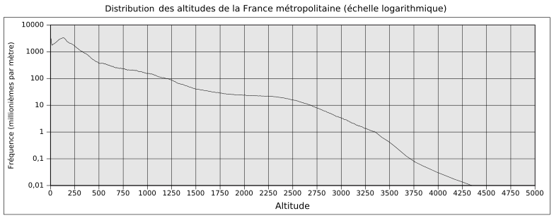

5 Retour sur l’introduction et applications
=========================================

5.1. La durée d’un prêt avec intérêts composés
-----------------------------------------

En cinquième année, vous avez appris la différence entre les intérêts
simples et les intérêts composés. Les premiers correspondent aux suites
arithmétiques tandis que les seconds correspondent aux suites
géométriques. Les suites arithmétiques sont généralement plus simples à
manipuler que les suites géométriques, comme en témoigne le double
problème suivant (que vous avez normalement déjà rencontré en cinquième
année, au moins sous une forme semblable).

**Problème** 

#. Vous déposez :math:`20000` euros sur un compte en banque avec des
   intérêts simples annuels de :math:`1,5 \%`. Combien d’années
   devez-vous attendre sans toucher à l’argent du compte pour accumuler
   :math:`25000` euros ?

#. Vous déposez :math:`20000` euros sur un compte en banque avec des
   intérêts composés annuels de :math:`1,5 \%`. Combien d’années
   devez-vous attendre sans toucher à l’argent du compte pour accumuler
   :math:`25000` euros ?

**Solution** 

#. Comme le compte est à intérêts simples, les différentes quantités
   d’argent présentes sur le compte forment une suite arithmétique de
   terme initial :math:`a=20000` et de raison
   :math:`r=0,015*20000=300`. Après :math:`x` années
   (:math:`x \in \mathbb{N}`), la somme d’argent sur le compte en
   banque est égale à :math:`20000+x*300`. On cherche donc à résoudre
   l’équation :

   .. math:: 20000+x*300=25000

   .. math:: x*300=5000

   .. math:: x=\frac{50}{3}\simeq 16,67

   Comme les intérêts sont annuels, il faudra attendre :math:`17` ans
   pour avoir au moins :math:`25000` euros sur le compte.
   *Remarque* : pour les intérêts simples, l’équation à résoudre pour
   trouver la solution au problème pouvait être résolue facilement. Il
   n’en va pas en être de même pour les intérêts composés.

#. Comme le compte est à intérêts composés, les différentes quantités
   d’argent présentes sur le compte forment une suite géométrique de
   terme initial :math:`b=20000` et de raison :math:`q=1,014`. Après
   :math:`x` années (:math:`x \in \mathbb{N}`), la somme d’argent sur
   le compte en banque est égale à :math:`20000*(1,014)^x`. On cherche
   donc à résoudre l’équation :

   .. math:: 20000*(1,014)^x=25000

   .. math:: (1,014)^x=\frac{5}{4}

   *Remarque* : pour les intérêts composés, l’équation à résoudre pour
   trouver la solution au problème ne pouvait pas être résolue
   facilement en cinquième année : vous en étiez réduit à rechercher à
   tâtons une valeur de :math:`x` pour laquelle
   :math:`(1,014)^x=\frac{5}{4}`. Néanmoins, nous connaissons à
   présent l’existence des fonctions logarithmes et nous pouvons donc
   exprimer la solution de cette équation.

   .. math:: x={\log}_{1,014}(\frac{5}{4})=\frac{\ln(\frac{5}{4})}{\ln(1,014)}\simeq 16,05

   Comme les intérêts sont annuels, il faudra attendre :math:`17` ans
   pour avoir au moins :math:`25000` euros sur le compte.

.. inginious:: app3

Ainsi, puisque nous sommes à présent capables de résoudre toute
équation de la forme :

.. math:: a^x = k

où :math:`a \in {{\mathbb{R}}_0}^{+} \backslash \{1\}` et
:math:`k \in {{\mathbb{R}}_0}^{+}` grâce aux logarithmes, nous sommes
capables de trouver la solution au problème de la durée d’un prêt (ou
d’un emprunt) aussi bien pour des intérêts simples que pour des
intérêts composés.

Entraînons-nous avec quelques exercices.

.. inginious:: app1_1
.. inginious:: app1_2
.. inginious:: app1_3
.. inginious:: app1_4

5.2 Le temps de décomposition d’une substance radioactive
-----------------------------------------------------

Comme vous l’avez vu ou le verrez dans votre cours de physique, les
isotopes instables ont la propriétés de se désintégrer de telle
manière qu’une même proportion d’atomes instables se désintègrent
toujours pour une même période de temps.

En particulier, il faudra toujours une même période de temps pour que
la moitié de la quantité d’un isotope radioactif se soit désintégrée :
cette période de temps est appelée la *demi-vie* de l’isotope (aussi
appelée période radioactive de l’isotope). Par exemple, la demi-vie du
plutonium :math:`239` est de :math:`24 110` années. Si vous possédez
:math:`1`\ kg de plutonium :math:`239`, il en restera :math:`500`\ g
après :math:`24 110` années, :math:`250`\ g après :math:`48 220`
années, :math:`125`\ g après :math:`72330` années et ainsi de suite.

Contrairement à ce que beaucoup de personnes croient, il ne suffit pas
de d’une période de temps égale à deux demi-vies d’une matière
radioactive pour que celle-ci se soit complétement désintégrée. C’est
par exemple un problème avec le radon :math:`222`, un isotope de ce
gaz noble qui est produit par la décomposition naturelle de l’uranium
présent dans le sol et dans les briques de certaines maisons (on
trouve par exemple parfois beaucoup d’uranium dans le granite, au
moins en comparaison d’autres matériaux). Celui-ci s’accumule parfois
dans des caves ou des pièces mal ventilées : lorsque des niveaux
dangereux sont atteints, il faut quitter l’endroit et aérer celui-ci
jusqu’à ce que le niveau de radon :math:`222` redevienne acceptable.

Ce danger du radon n’est pas anodin : selon l’organisation mondiale de
la santé, le rayonnement du radon :math:`222` serait responsable de
:math:`3` à :math:`14 \%` des cancers pulmonaires, ce qui en fait la
deuxième cause de cancer pulmonaire après le tabac [2]_. Trop souvent,
une fois qu’un niveau dangereux de radon est découvert dans une
maison, les habitants n’attendent malheureusement que :math:`2`
demi-vies du radon :math:`222`, c’est-à-dire deux fois :math:`3,824`
jours (une bonne semaine), pour revenir chez eux, croyant que le radon
a alors complétement disparu.

Pour déterminer le moment exact où il n’est plus considéré dangereux
de revenir habiter dans un habitat dans lequel il a été mesuré un
niveau de concentration dangereux de radon :math:`222`, il est
nécessaire de résoudre une équation dont la solution ne peut
s’exprimer la plupart du temps qu’à l’aide des logarithmes. Donnons un
exemple concret. En Europe, pour les vieux bâtiments, la valeur
maximale recommandée de radiation due au radon :math:`222` est de
:math:`400`\ Bq/m\ :math:`^3`\  [3]_

Si on note par exemple :math:`A` l’activité exprimée en Becquerels
(c’est-à-dire le nombre de désintégration par seconde) d’une certaine
quantité de radon :math:`222`, si on note :math:`m` la masse de radon
considérée (exprimée en grammes), :math:`M \simeq 222`\ g/mol la masse
molaire du radon :math:`222`,
:math:`N_A \simeq 6,02214179.10^{23}`\ mol\ :math:`^{-1}` la constante
d’Avogadro et :math:`t_{\frac{1}{2}} \simeq 3,304.10^8`\ s le temps de
demi-vie du radon :math:`222`, on a la relation :

.. math:: A=\frac{m}{M}N_A \frac{\ln(2)}{t_{\frac{1}{2}}}

Dès lors, si on constate dans une pièce une concentration de radon
:math:`222` telle qu’on détecte :math:`2000`\ Bq/m\ :math:`^3`, la
quantité de radon au mètre cube est égale à :

.. math:: m=\frac{AMt_{\frac{1}{2}}}{N_A\ln(2)}=\frac{2000.222.3,304.10^8}{6,02214179.10^{23}.\ln(2)} \simeq 3,51436262.10^{-10}

Autrement dit, la concentration de radon :math:`222` dans la pièce est
de :math:`0,351436262`\ ng/m\ :math:`^3`.

Une concentration de radon :math:`222` acceptable correspond à une
détection de :math:`400`\ Bq/m\ :math:`^3`, c’est-à-dire à une
concentration de :

.. math:: m=\frac{AMt_{\frac{1}{2}}}{N_A\ln(2)}=\frac{400.222.3,304.10^8}{6,022 141 79.10^{23}.\ln(2)}\simeq 7,02872524.10^{-11}

Autrement dit, une concentration de
:math:`0,0702872524`\ ng/m\ :math:`^3`. Pour arriver à cette
concentration, combien de jours faudra-t-il attendre ? Pour répondre à
cette question, il faut résoudre l’équation :

.. math:: 0,351436262*\left(\frac{1}{2}\right)^{\frac{x}{3,824}}=0,0702872524

.. math:: \left(\frac{1}{2}\right)^{\frac{x}{3,824}}=\frac{0,0702872524}{0,351436262}

.. math:: \frac{x}{3,824}={\log}_{\frac{1}{2}}(\frac{0,0702872524}{0,351436262})

.. math:: x=3,824{\log}_{\frac{1}{2}}(\frac{0,0702872524}{0,351436262})

.. math:: x \simeq 8.87905

Il faut donc attendre presque :math:`9` jours en aérant correctement
l’habitation pour revenir à des niveaux acceptables de concentration
en radon :math:`222`.
 
Ce type de calcul est également réalisé pour déterminer la durabilité
souhaitable des entrepôts sécurisés de déchets radioactifs des
centrales. Pour ceux-ci, les demi-vies sont généralement beaucoup plus
longues que celle du radon :math:`222`.

**Remarque 5.2.1.** L’idée de demi-vie est aussi utilisée dans d’autres contextes, par
exemple en chimie avec le temps de demi-réaction qui correspond au temps
nécessaire pour que la moitié des réactifs en présence (restants) aient
réagi.

.. inginious:: app2_1

.. inginious:: app2_2

5.3 Les échelles logarithmiques
---------------------------

De nombreuses unités et échelles en sciences sont définies à l’aide
des logarithmes. Citons par exemple le décibel (son), le pH (acidité)
ou encore la magnitude de moment (tremblements de terre) [4]_.

Intéressons-nous à ce dernier exemple. Les tremblements de terre
peuvent libérer des quantités d’énergie inconcevables et c’est l’ordre
de grandeur de cette quantité d’énergie qui permet de différencier les
séismes. Pour cette raison, on utilise une échelle logarithmique pour
classifier les tremblements de terre. En effet, si on note :math:`M_0`
(en N.m) le moment sismique d’un tremblement de terre (ce qui
correspond grossièrement à la mesure de l’énergie mesurée d’un
tremblement de terre), la définition de la magnitude du moment d’un
tremblement de terre est la suivante :

.. math:: M_{w} = \frac{2}{3} {\log}_{10} (M_0) - 6,07

Par exemple, si un tremblement de terre à un moment sismique de 100
milliards N.m, sa magnitude est de :

.. math:: M_{w} = \frac{2}{3} {\log}_{10^{11}} (M_0) - 6,07

.. math:: M_{w} = \frac{2}{3} 11 (M_0) - 6,07

.. math:: M_{w} = \frac{22}{3} - 6,07

.. math:: M_{w} \simeq 1,26

Que se passe-t-il si le tremblement de terre libérait en fait le
double de ce qu’on avait mesuré initialement, c’est-à-dire 200
milliards N.m. Dans ce cas, sa magnitude est de :

.. math:: M_{w} = \frac{2}{3} {\log}_{2.10^{11}} (M_0) - 6,07

.. math:: M_{w} \simeq 1,46

Sa magnitude ne double absolument pas !

Ce phénomène correspond au fait que la magnitude (du moment) pour les
tremblements de terre est une échelle logarithmique. D’un point de vue
technique, cela signifie qu’elle a été définie à l’aide d’une fonction
logarithme. En pratique, cela signifie qu’il s’agit d’une échelle qui
s’intéresse plutôt à l’ordre de grandeur de ce qui est mesuré plutôt
qu’à la valeur exacte de ce qui est mesuré.

Ce type d’échelle est extrêmement utile et répandu (en particulier en
sciences) et correspond même à la façon dont nous mesurons
intuitivement les choses. Une expérience classique de psychologie est
de donner deux poids de forme identique à une personne qui a les yeux
bandés et de lui demander de décider quel est celui qui pèse le plus
lourd. À la première étape de l’expérience, on donne à la personne un
poids de 2kg et un poids de 2,2kg. La quasi totalité des personnes
testées déterminent correctement le bon poids. À la deuxième étape de
l’expérience, on donne un poids de 20kg et un poids de 20,2kg. La
quasi totalité des personnes testées ne sont pas capables de
déterminer correctement le bon poids. À la trosième étape de
l’expérience, on donne un poids de 20kg et un poids de 22kg. La
majeure partie des personnes testées sont capables de déterminer
correctement le bon poids. Cette expérience (que vous pouvez simuler
vous-mêmes) montre que nous évaluons des différences relatives et des
ordres de grandeur plutôt que des différences absolues et des valeurs
exactes. C’est facilement compréhensible : pour un être humain, il est
inutile d’être par exemple capable de d’estimer si la température
d’une plaque de cuisson récemment éteinte est précisément de
:math:`10^{\degree}`\ C ou de :math:`11^{\degree}`\ C, mais par contre
extrêmement important de savoir estimer rapidement si elle est de
:math:`10^{\degree}`\ C ou de :math:`100^{\degree}`\ C.

Revenons à notre exemple de la magnitude des tremblements de terre.
Comprendre qu’il s’agit d’une échelle logarithmique permet de
comprendre pourquoi un tremblement de terre d’une magnitude de
:math:`6` n’est pas simplement deux fois aussi puissant (et
dévastateur) qu’un tremblement de terre d’une magnitude de :math:`3`.
En effet, calculons les énergies libérées par un tremblement de terre
d’une magnitude de :math:`3` et par un tremblement de terre libérée
d’une magnitude de :math:`6`. Commençons avec le cas du tremblement de
terre d’une magnitude de :math:`3`, quel est son moment ?

.. math:: 3 = \frac{2}{3} {\log}_{10} (M_0) - 6,07

.. math:: 9,07 = \frac{2}{3} {\log}_{10} (M_0)

.. math:: \frac{3}{2}.9,07 =  {\log}_{10} (M_0)

.. math:: 13,605={\log}_{10} (M_0)

.. math:: 10^{13,605}=M_0

.. math:: M_0 \simeq 40000000000000

Qu’en est-il du tremblement de terre d’un magnitude de :math:`6` ?

.. math:: 6 = \frac{2}{3} {\log}_{10} (M_0) - 6,07

.. math:: 12,07 = \frac{2}{3} {\log}_{10} (M_0)

.. math:: \frac{3}{2}.9,07 =  {\log}_{10} (M_0)

.. math:: 18,105={\log}_{10} (M_0)

.. math:: M_0 \simeq 1200000000000000000

.. math:: M_0 \simeq 120000

On en déduit qu’un tremblement de terre d’une magnitude de :math:`6`
est en fait :math:`120000` fois aussi puissant qu’un tremblement de
terre de magnitude :math:`3`. Pas étonnant qu’un tremblement de terre
de magnitude :math:`3` (il s’en produit en moyenne un par an en
Belgique et personne n’en parle) cause beaucoup de dommages que la
moitié des dommages causés par un tremblement de terre de magnitude
:math:`6` (seuls les bâtiments spécifiquement conçus pour résister aux
tremblements de terre ne s’écroulent pas avec une telle magnitude).
Comme on le voit, comprendre le fonctionnement des logarithmes permet
de comprendre la véritable signification de toute donnée exprimée à
l’aide d’une échelle logarithmique.

Il est à noter que les échelles logarithmiques permettent souvent de
représenter de façon bien plus efficaces des données aux ordres de
grandeurs très disparates.

Par exemple, le graphe ci-dessous aurait été irréalisable (ou
illisible) si une échelle logarithmique n’avait pas été utilisée pour
les fréquences :

|image2|

En effet, puisque les fréquences présentent des ordres de grandeurs très
différents, un graphique avec des échelles linéaires devrait faire le
choix : soit choisir une échelle pour les fréquences qui permet de
rendre compte des variations pour les petites fréquences, soit choisir
une échelle pour les fréquences qui permet de rendre compte des
variations pour les grandes fréquences. Il serait alors impossible de
rendre compte des variations de l’ensemble de la distribution de manière
lisible.

Terminons ce chapitre avec quelques exercices sur la magnitude du moment
des tremblements de terre et sur les échelles logarithmiques.

**Exercice 5.3.2.** 

.. inginious:: app4_1

**Exercice 5.3.3.** 

.. inginious:: app4_2

**Exercice 5.3.4.** 

.. inginious:: app4_3

**Exercice 5.3.5.** Voici un graphe de l’évolution des approximations du nombre :math:`\pi`
par les êtres humains :

|image3|

Essayer de représenter ce graphe sans utiliser d’échelle logarithmique.
Que constatez-vous ?

**Solution.** Avec une échelle linéaire pour le nombre de décimales, soit l’évolution
entre l’an :math:`-2000` et l’an :math:`1950` semble nulle (si on
choisit une grande échelle, soit l’évolution entre l’an :math:`1950` et
aujourd’hui n’est pas représentable.

5.4 La vérité sur les exposants irrationnels
----------------------------------------

Section supprimée.

5.5 Équations différentielles et écosystèmes
----------------------------------------

Section supprimée.

5.6 Complexité algorithmique, algorithmes de tri et P=NP
----------------------------------------------------

Section supprimée.

5.7 Tour de Pise et série harmonique
--------------------------------

Section supprimée.

.. [1]
   John Napier, ou Jean Neper en français, a vécu entre 1550 et 1617 et
   est considéré comme l’inventeur des logarithmes. Il a développé
   ceux-ci pour simplifier ses calculs d’astronomie.

.. [2]
   Source : https://www.who.int/cancer/prevention/fr/

.. [3]
   De façon intéressante, la norme est de
   :math:`150`\ \ Bq/m\ \ :math:`^3` aux États-Unis.

.. [4]
   La magnitude de moment est souvent appelée magnitude de l’échelle de
   Richter dans les médias. C’est une erreur : l’échelle de Richter
   était une échelle locale uniquement valable pour les tremblements de
   terre californiens. Elle n’est plus utilisée aujourd’hui par les
   scientifiques.

.. |image1| image:: bijection.png

.. |image3| image:: pilog.png
